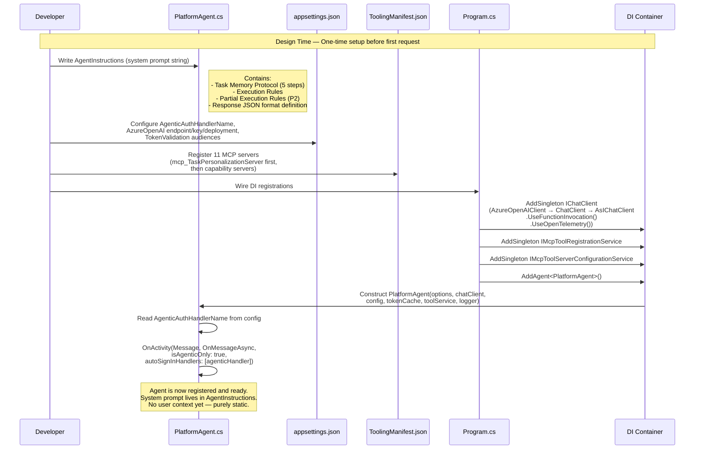
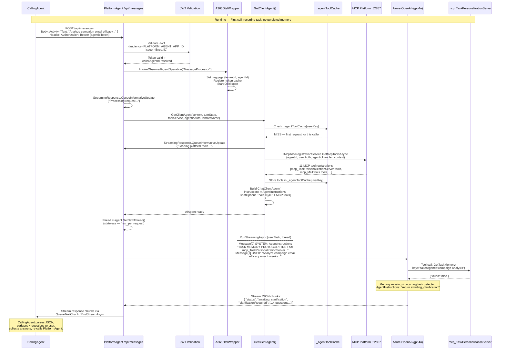
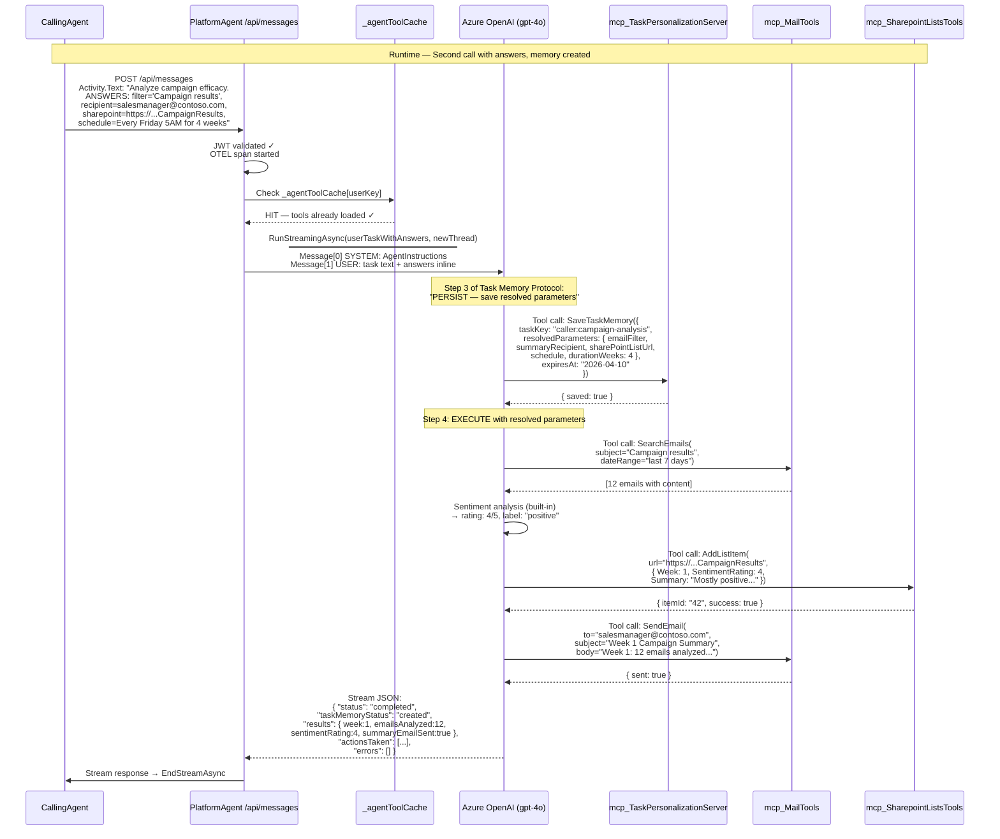
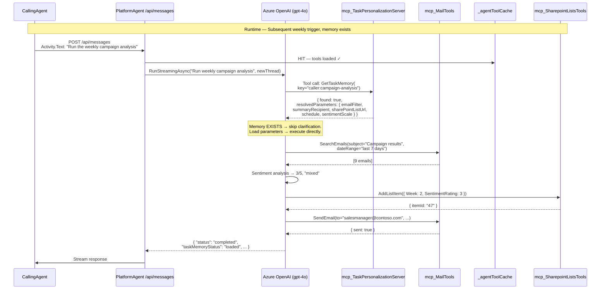
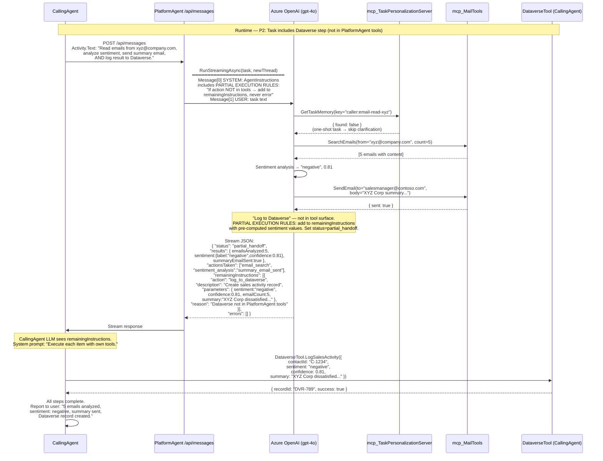

# PlatformAgent — Design Review Document

> **Purpose**: Full end-to-end design for review before implementation begins.
> **Status**: Pre-implementation — no code written yet.
> **Scope**: PlatformAgent only. Calling agents (SalesAgent, HRAgent, etc.) are out of scope.

---

## 1. What Problem This Solves

Today, each agent that needs to work with email, summarization, sentiment analysis, Teams, SharePoint, or Calendar must independently wire up MCP server connections, manage authentication, and implement tool-loading logic. This leads to duplication across agents and requires every agent developer to understand the MCP Platform internals.

Beyond the tooling problem, long-running agentic tasks (e.g., "analyze campaign emails for 4 weeks") require the agent to ask clarifying questions **every single invocation** if there is no memory of prior context. This is inefficient and creates poor user experience.

**PlatformAgent** solves both problems:

1. **Shared capability hub** — any calling agent sends a natural language task and PlatformAgent handles tool selection, MCP auth, and execution
2. **Persistent task memory** — `mcp_TaskPersonalizationServer` stores resolved task instructions (answers to clarification questions) so subsequent calls or scheduled triggers execute directly without re-asking the user

---

## 1a. Hero Scenario

An enterprise deploys a Digital Worker (Sales Agent) to track campaign efficiency and provide automated reporting. Given a campaign document, the agent analyzes email responses over a 4-week period, logs sentiment ratings in a SharePoint list, and sends weekly summaries to designated recipients.

### Hero Prompt

> "Analyze the efficacy of the campaign over the course of the next 4 weeks by looking at responses and log a market sentiment rating on a scale of 1–5 (1 being lowest, 5 being best) in a SharePoint list."

### Agent Clarification Loop (First Call Only)

Before executing, PlatformAgent decomposes the query and resolves ambiguities through a structured clarification exchange with the user (via the calling agent):

| Clarification Question | Example Answer |
|---|---|
| How should emails be identified? | Look for emails with "Campaign results" in the subject |
| Who receives the weekly summary? | salesmanager@contoso.com |
| Which SharePoint list should ratings be logged to? | https://contoso.sharepoint.com/sites/sales/Lists/CampaignResults |
| When should the weekly summary be sent? | Every Friday at 5:00 AM for the next 4 weeks |

### What Happens After Clarification

1. The resolved instructions are **persisted to `mcp_TaskPersonalizationServer`** as a named task memory, keyed by task type (e.g., `campaign-analysis`) and caller agent identity
2. Every subsequent event trigger or call (weekly scheduler, new email notification) **loads the persisted memory first** — no re-clarification needed
3. The calling agent can also **override** a specific parameter without invalidating the rest of the memory

---

## 2. Architecture

### 2.1 System Diagram

```
┌─────────────────────────────────────────────────────────────┐
│                Calling Agents (out of scope)                 │
│                                                             │
│  ┌─────────────┐  ┌─────────────┐  ┌─────────────┐         │
│  │ SalesAgent  │  │  HRAgent   │  │FinanceAgent │         │
│  └──────┬──────┘  └──────┬──────┘  └──────┬──────┘         │
│         └────────────────┴────────────────┘                 │
│                          │                                  │
│           PlatformAgentProxyTool.Execute(task)               │
└──────────────────────────┼──────────────────────────────────┘
                           │ Bot Framework Activity
                           │ POST /api/messages
                           │ Authorization: Bearer {agenticToken}
                           │
┌──────────────────────────▼──────────────────────────────────┐
│                       PlatformAgent                          │
│                                                             │
│  ┌──────────────────────────────────────────────────────┐   │
│  │                   PlatformAgent.cs                   │   │
│  │                                                     │   │
│  │  1. Validate agentic token                          │   │
│  │  2. Load MCP tools (all servers)                    │   │
│  │  3. CHECK mcp_TaskPersonalizationServer             │   │◄──┐
│  │     ├─ Task memory EXISTS? → load & execute         │   │   │
│  │     └─ Task memory MISSING? → clarify → persist ───►│   │───┘
│  │  4. LLM decomposes task into sequential tool calls  │   │
│  │  5. Execute tools (email, SharePoint, Teams, etc.)  │   │
│  │  6. Return structured JSON response                 │   │
│  └──────────────────┬────────────────────────────────── ┘   │
│                     │ IMcpToolRegistrationService             │
└─────────────────────┼───────────────────────────────────────┘
                      │
┌─────────────────────▼───────────────────────────────────────┐
│                MCP Platform (localhost:52857)                 │
│                                                             │
│  ┌──────────────────────────────────────────────────────┐   │
│  │  mcp_TaskPersonalizationServer  ◄── PERSISTENCE LAYER│   │
│  │  (stores/retrieves task memory by key)               │   │
│  └──────────────────────────────────────────────────────┘   │
│                                                             │
│  mcp_MailTools          mcp_M365Copilot                     │
│  mcp_WebSearchTools     mcp_WebSearchServer                 │
│  mcp_SimpleTools        mcp_KnowledgeTools                  │
│  mcp_SharepointListsTools   mcp_CalendarTools               │
│  mcp_TeamsServer        mcp_MeServerV2                      │
└─────────────────────────────────────────────────────────────┘
```

### 2.2 What PlatformAgent Handles

| Capability | MCP Server | Example Operations |
|---|---|---|
| **Task memory / persistence** | `mcp_TaskPersonalizationServer` | Store/load task instructions by key, clarification answers, run parameters |
| Read/send email | `mcp_MailTools` | Read inbox, get email by sender, send, reply |
| Summarization | `mcp_M365Copilot` | Summarize text, generate email drafts |
| Sentiment analysis | LLM built-in + `mcp_WebSearchTools` | Classify tone: positive/negative/neutral + confidence |
| Web search | `mcp_WebSearchServer` | External research, enrichment |
| Knowledge retrieval | `mcp_KnowledgeTools` | Search internal knowledge base |
| SharePoint Lists | `mcp_SharepointListsTools` | Read/write list entries |
| Calendar | `mcp_CalendarTools` | Check/create calendar events |
| Teams | `mcp_TeamsServer` | Post messages, read channels |
| User info | `mcp_MeServerV2` | Current user profile/context |
| Utilities | `mcp_SimpleTools` | Formatting, parsing, misc |

### 2.3 Partial Execution & Instruction Handoff

**PlatformAgent does not treat missing capabilities as errors.**

When a task includes actions that PlatformAgent cannot handle (e.g., Dataverse writes, CRM updates, custom APIs), it:

1. Executes all steps it **can** handle (email, SharePoint, sentiment, Teams, etc.)
2. Returns the results of those steps **plus** a `remainingInstructions` list for the calling agent
3. The calling agent then executes the remaining instructions using its own tools

This makes PlatformAgent a **turnkey platform component** — it owns M365/Graph actions end-to-end while specialized agents own their domain-specific actions. The composition is driven by the calling agent's orchestration loop, not by PlatformAgent's knowledge of the caller.

```
CallingAgent receives full task:
  "Search emails, analyze sentiment, log to Dataverse, send summary email"
        │
        ▼
DelegateToPlatformAgent(full task)
        │
        ▼
PlatformAgent:
  ✓ Search emails          (mcp_MailTools)
  ✓ Analyze sentiment      (LLM built-in)
  ✓ Send summary email     (mcp_MailTools)
  ✗ Log to Dataverse       → NOT available → add to remainingInstructions
        │
        ▼
Returns:
  {
    "status": "partial_handoff",
    "results": { emailsSentiment, summaryEmailSent },
    "remainingInstructions": [
      {
        "action": "log_to_dataverse",
        "description": "Log sentiment rating to Dataverse sales activity record",
        "parameters": { "sentiment": "negative", "confidence": 0.87, "subject": "..." }
      }
    ]
  }
        │
        ▼
CallingAgent executes remainingInstructions using its own tools:
  → DataverseTool.LogSalesActivity(sentiment="negative", ...)
```

**Pre and post actions** follow the same pattern. The calling agent may execute steps before or after calling PlatformAgent:

```
CallingAgent workflow:
  1. PRE: Fetch campaign document from CRM (caller's tool)
  2. DELEGATE: Call PlatformAgent with email analysis + SharePoint logging
  3. POST: Execute remainingInstructions (Dataverse logging, CRM update)
  4. REPORT: Summarize all results to user
```

### 2.4 What PlatformAgent Does NOT Handle

The following are **never** handled by PlatformAgent and will always appear in `remainingInstructions`:

- Dataverse CRUD operations
- Custom CRM integrations (Salesforce, Dynamics custom tables)
- Business logic / decision making
- Direct user conversation (agentic-only)
- Any capability not exposed by its registered MCP servers

---

## 3. Project Structure

```
dotnet/agent-framework/
├── sample-agent/                         # Existing — DO NOT MODIFY
│   └── Agent/MyAgent.cs                  # Reference implementation
└── platform-agent/                       # NEW project (this design)
    ├── platform-agent.csproj             # Project file (same NuGet packages as sample-agent)
    ├── Program.cs                        # ASP.NET Core startup
    ├── AspNetExtensions.cs               # JWT validation (copied from sample-agent)
    ├── Agent/
    │   └── PlatformAgent.cs             # Main agent class
    ├── telemetry/
    │   ├── A365OtelWrapper.cs           # Observability wrapper (copied)
    │   ├── AgentMetrics.cs              # Metrics/tracing (copied)
    │   └── AgentOTELExtensions.cs       # OpenTelemetry setup (copied)
    ├── ToolingManifest.json             # All MCP servers (10 enabled)
    ├── appsettings.json                 # Production config (agentic-only auth)
    ├── appsettings.Development.json     # Dev overrides
    ├── appsettings.Playground.json      # Playground UI testing (auth disabled)
    └── manifest/
        ├── manifest.json               # Teams app manifest
        ├── color.png                   # 192x192 icon
        └── outline.png                 # 32x32 icon
```

> Each sample is **self-contained** — telemetry and extension files are copied, not shared via a common library. This follows the existing repository pattern.

---

## 4. File-by-File Design

### 4.1 `platform-agent.csproj`

Identical NuGet packages to `sample-agent`, minus `OpenWeatherMapSharp` (not needed). No new packages required.

```xml
<Project Sdk="Microsoft.NET.Sdk.Web">
  <PropertyGroup>
    <TargetFramework>net8.0</TargetFramework>
    <ImplicitUsings>enable</ImplicitUsings>
    <UserSecretsId><!-- new GUID --></UserSecretsId>
    <Nullable>enable</Nullable>
  </PropertyGroup>
  <ItemGroup>
    <!-- A365 SDK -->
    <PackageReference Include="Microsoft.Agents.A365.Tooling.Extensions.AgentFramework" Version="*-beta.*" />
    <PackageReference Include="Microsoft.Agents.A365.Observability.Extensions.AgentFramework" Version="*-beta.*" />
    <!-- Agent Framework -->
    <PackageReference Include="Azure.AI.OpenAI" Version="2.5.0-beta.1" />
    <PackageReference Include="Azure.Identity" Version="1.17.0" />
    <PackageReference Include="Microsoft.Agents.AI" Version="1.0.0-preview.251113.1" />
    <PackageReference Include="Microsoft.Agents.Authentication.Msal" Version="1.3.*-*" />
    <PackageReference Include="Microsoft.Agents.Hosting.AspNetCore" Version="1.3.*-*" />
    <PackageReference Include="Microsoft.Extensions.AI.OpenAI" Version="9.10.0-preview.1.25513.3" />
    <!-- Telemetry -->
    <PackageReference Include="Microsoft.Extensions.Http.Resilience" Version="9.9.0" />
    <PackageReference Include="Microsoft.Extensions.ServiceDiscovery" Version="9.5.0" />
    <PackageReference Include="OpenTelemetry.Exporter.OpenTelemetryProtocol" Version="1.12.0" />
    <PackageReference Include="OpenTelemetry.Extensions.Hosting" Version="1.12.0" />
    <PackageReference Include="OpenTelemetry.Instrumentation.AspNetCore" Version="1.12.0" />
    <PackageReference Include="OpenTelemetry.Instrumentation.Http" Version="1.12.0" />
    <PackageReference Include="OpenTelemetry.Instrumentation.Runtime" Version="1.12.0" />
  </ItemGroup>
</Project>
```

---

### 4.2 `Program.cs`

Nearly identical to `sample-agent/Program.cs` with two changes:
1. Register `PlatformAgent` instead of `MyAgent`
2. Remove `OpenWeatherApiKey` validation (no local tools)

```csharp
// Copyright (c) Microsoft Corporation.
// Licensed under the MIT License.

using Agent365PlatformAgent;
using Agent365PlatformAgent.Agent;
using Agent365PlatformAgent.telemetry;
using Azure;
using Azure.AI.OpenAI;
using Microsoft.Agents.A365.Observability;
using Microsoft.Agents.A365.Observability.Extensions.AgentFramework;
using Microsoft.Agents.A365.Observability.Runtime;
using Microsoft.Agents.A365.Tooling.Extensions.AgentFramework.Services;
using Microsoft.Agents.A365.Tooling.Services;
using Microsoft.Agents.Builder;
using Microsoft.Agents.Core;
using Microsoft.Agents.Hosting.AspNetCore;
using Microsoft.Agents.Storage;
using Microsoft.Agents.Storage.Transcript;
using Microsoft.Extensions.AI;
using System.Reflection;

var builder = WebApplication.CreateBuilder(args);

if (builder.Environment.IsDevelopment())
{
    AppContext.SetSwitch("System.Net.Http.SocketsHttpHandler.Http2Support", false);
}

builder.ConfigureOpenTelemetry();
builder.Configuration.AddUserSecrets(Assembly.GetExecutingAssembly());
builder.Services.AddControllers();
builder.Services.AddHttpClient("WebClient", client => client.Timeout = TimeSpan.FromSeconds(600));
builder.Services.AddHttpContextAccessor();
builder.Logging.AddConsole();

// A365 Services
builder.Services.AddAgenticTracingExporter(clusterCategory: "production");
builder.AddA365Tracing(config => { config.WithAgentFramework(); });
builder.Services.AddSingleton<IMcpToolRegistrationService, McpToolRegistrationService>();
builder.Services.AddSingleton<IMcpToolServerConfigurationService, McpToolServerConfigurationService>();

builder.Services.AddAgentAspNetAuthentication(builder.Configuration);
builder.Services.AddSingleton<IStorage, MemoryStorage>();
builder.AddAgentApplicationOptions();
builder.AddAgent<PlatformAgent>();   // <-- PlatformAgent, not MyAgent

builder.Services.AddSingleton<IChatClient>(sp => {
    var confSvc = sp.GetRequiredService<IConfiguration>();
    var endpoint = confSvc["AIServices:AzureOpenAI:Endpoint"] ?? string.Empty;
    var apiKey = confSvc["AIServices:AzureOpenAI:ApiKey"] ?? string.Empty;
    var deployment = confSvc["AIServices:AzureOpenAI:DeploymentName"] ?? string.Empty;

    // No OpenWeatherApiKey validation (PlatformAgent has no local tools)
    AssertionHelpers.ThrowIfNullOrEmpty(endpoint, "AIServices:AzureOpenAI:Endpoint is required.");
    AssertionHelpers.ThrowIfNullOrEmpty(apiKey, "AIServices:AzureOpenAI:ApiKey is required.");
    AssertionHelpers.ThrowIfNullOrEmpty(deployment, "AIServices:AzureOpenAI:DeploymentName is required.");

    return new AzureOpenAIClient(new Uri(endpoint), new AzureKeyCredential(apiKey))
        .GetChatClient(deployment).AsIChatClient().AsBuilder()
        .UseFunctionInvocation()
        .UseOpenTelemetry(sourceName: AgentMetrics.SourceName, configure: cfg => cfg.EnableSensitiveData = true)
        .Build();
});

builder.Services.AddSingleton<Microsoft.Agents.Builder.IMiddleware[]>(
    [new TranscriptLoggerMiddleware(new FileTranscriptLogger())]);

var app = builder.Build();
if (app.Environment.IsDevelopment()) app.UseDeveloperExceptionPage();
app.UseRouting();
app.UseAuthentication();
app.UseAuthorization();

app.MapPost("/api/messages", async (HttpRequest request, HttpResponse response,
    IAgentHttpAdapter adapter, IAgent agent, CancellationToken cancellationToken) =>
{
    await AgentMetrics.InvokeObservedHttpOperation("agent.process_message", async () =>
        await adapter.ProcessAsync(request, response, agent, cancellationToken));
});

app.MapGet("/api/health", () => Results.Ok(new { status = "healthy", timestamp = DateTime.UtcNow }));

if (app.Environment.IsDevelopment() || app.Environment.EnvironmentName == "Playground")
{
    app.MapGet("/", () => "PlatformAgent — Shared Capability Hub");
    app.UseDeveloperExceptionPage();
    app.MapControllers().AllowAnonymous();
    app.Urls.Add("http://localhost:3979");   // Different port from sample-agent (3978)
}
else
{
    app.MapControllers();
}

app.Run();
```

> **Note**: Port `3979` instead of `3978` to allow running alongside `sample-agent` locally.

---

### 4.3 `Agent/PlatformAgent.cs`

Key differences from `sample-agent/Agent/MyAgent.cs`:

| Aspect | sample-agent (MyAgent) | platform-agent (PlatformAgent) |
|---|---|---|
| Routes | Agentic + non-agentic (dual) | **Agentic-only** (single route) |
| Local tools | DateTime, Weather (2 tools) | **None** — all tools from MCP |
| Thread state | Persisted across turns | **Fresh thread per request** (stateless) |
| System prompt | Weather/profile assistant | **Task decomposition + structured JSON output** |
| Welcome message | Yes (Teams) | **None** (never user-facing) |
| OboAuthHandlerName | Used | **Not used** |

```csharp
// Copyright (c) Microsoft Corporation.
// Licensed under the MIT License.

using Agent365PlatformAgent.telemetry;
using Microsoft.Agents.A365.Observability.Caching;
using Microsoft.Agents.A365.Runtime.Utils;
using Microsoft.Agents.A365.Tooling.Extensions.AgentFramework.Services;
using Microsoft.Agents.A365.Tooling.Models;
using Microsoft.Agents.A365.Tooling.Services;
using Microsoft.Agents.AI;
using Microsoft.Agents.Builder;
using Microsoft.Agents.Builder.App;
using Microsoft.Agents.Builder.State;
using Microsoft.Agents.Core;
using Microsoft.Agents.Core.Models;
using Microsoft.Extensions.AI;
using System.Collections.Concurrent;
using System.Text.Json;

namespace Agent365PlatformAgent.Agent
{
    public class PlatformAgent : AgentApplication
    {
        private readonly string AgentInstructions = """
            You are PlatformAgent, a shared capability service for other AI agents.
            You receive task descriptions from calling agents and execute them autonomously
            using your available tools (email, web search, summarization, calendar, Teams, SharePoint).

            RULES:
            - Decompose multi-step tasks into sequential tool calls. Do not ask for clarification.
            - For email workflows: read → summarize/analyze → act (send/reply) in that order.
            - For sentiment analysis: classify as "positive", "negative", or "neutral" with a
              confidence score between 0.0 and 1.0.
            - Always return a structured JSON response in this exact format:
              {
                "status": "completed" | "partial" | "failed",
                "results": { ... task-specific key/value pairs ... },
                "actionsTaken": ["tool_name_1", "tool_name_2"],
                "errors": ["optional error messages if any step failed"]
              }
            - If a capability is unavailable, set status to "partial" and document what succeeded
              and what did not in the errors array.
            - Never ask clarifying questions. Infer intent and complete the task.
            """;

        private readonly IChatClient? _chatClient;
        private readonly IConfiguration? _configuration;
        private readonly IExporterTokenCache<AgenticTokenStruct>? _agentTokenCache;
        private readonly ILogger<PlatformAgent>? _logger;
        private readonly IMcpToolRegistrationService? _toolService;
        private readonly IMcpToolServerConfigurationService? _toolServerConfigService;
        private readonly string? AgenticAuthHandlerName;
        private static readonly ConcurrentDictionary<string, List<AITool>> _agentToolCache = new();

        public static bool TryGetBearerTokenForDevelopment(out string? bearerToken)
        {
            bearerToken = Environment.GetEnvironmentVariable("BEARER_TOKEN");
            return !string.IsNullOrEmpty(bearerToken);
        }

        private static bool ShouldSkipToolingOnErrors()
        {
            var env = Environment.GetEnvironmentVariable("ASPNETCORE_ENVIRONMENT") ??
                      Environment.GetEnvironmentVariable("DOTNET_ENVIRONMENT") ?? "Production";
            var skip = Environment.GetEnvironmentVariable("SKIP_TOOLING_ON_ERRORS");
            return env.Equals("Development", StringComparison.OrdinalIgnoreCase) &&
                   "true".Equals(skip, StringComparison.OrdinalIgnoreCase);
        }

        public PlatformAgent(
            AgentApplicationOptions options,
            IChatClient chatClient,
            IConfiguration configuration,
            IExporterTokenCache<AgenticTokenStruct> agentTokenCache,
            IMcpToolRegistrationService toolService,
            IMcpToolServerConfigurationService toolServerConfigService,
            ILogger<PlatformAgent> logger) : base(options)
        {
            _chatClient = chatClient;
            _configuration = configuration;
            _agentTokenCache = agentTokenCache;
            _logger = logger;
            _toolService = toolService;
            _toolServerConfigService = toolServerConfigService;

            AgenticAuthHandlerName = _configuration.GetValue<string>("AgentApplication:AgenticAuthHandlerName");

            // AGENTIC-ONLY: PlatformAgent does not accept direct user requests.
            // Calling agents must present a valid agentic token.
            var agenticHandlers = !string.IsNullOrEmpty(AgenticAuthHandlerName)
                ? new[] { AgenticAuthHandlerName }
                : Array.Empty<string>();
            OnActivity(ActivityTypes.Message, OnMessageAsync, isAgenticOnly: true,
                autoSignInHandlers: agenticHandlers);
        }

        protected async Task OnMessageAsync(
            ITurnContext turnContext, ITurnState turnState, CancellationToken cancellationToken)
        {
            // PlatformAgent only accepts agentic requests — always use agentic auth handler
            string? authHandlerName = AgenticAuthHandlerName;

            await A365OtelWrapper.InvokeObservedAgentOperation(
                "PlatformAgent.MessageProcessor",
                turnContext, turnState, _agentTokenCache,
                UserAuthorization, authHandlerName ?? string.Empty, _logger,
                async () =>
                {
                    await turnContext.StreamingResponse.QueueInformativeUpdateAsync(
                        "Processing request...").ConfigureAwait(false);
                    try
                    {
                        var userText = turnContext.Activity.Text?.Trim() ?? string.Empty;
                        var agent = await GetClientAgent(turnContext, turnState, _toolService, authHandlerName);

                        // Stateless: fresh thread per agentic request (no cross-call memory)
                        var thread = agent!.GetNewThread();

                        await foreach (var response in agent.RunStreamingAsync(
                            userText, thread, cancellationToken: cancellationToken))
                        {
                            if (response.Role == ChatRole.Assistant && !string.IsNullOrEmpty(response.Text))
                                turnContext?.StreamingResponse.QueueTextChunk(response.Text);
                        }
                        // Note: thread state is NOT saved — each agentic call is independent
                    }
                    finally
                    {
                        await turnContext.StreamingResponse.EndStreamAsync(cancellationToken)
                            .ConfigureAwait(false);
                    }
                });
        }

        private async Task<AIAgent?> GetClientAgent(
            ITurnContext context, ITurnState turnState,
            IMcpToolRegistrationService? toolService, string? authHandlerName)
        {
            AssertionHelpers.ThrowIfNull(_configuration!, nameof(_configuration));
            AssertionHelpers.ThrowIfNull(context, nameof(context));
            AssertionHelpers.ThrowIfNull(_chatClient!, nameof(_chatClient));

            // PlatformAgent has NO local tools — all tools come from MCP servers
            var toolList = new List<AITool>();

            if (toolService != null)
            {
                try
                {
                    string toolCacheKey = GetToolCacheKey(turnState);
                    if (_agentToolCache.TryGetValue(toolCacheKey, out var cached) && cached?.Count > 0)
                    {
                        toolList.AddRange(cached);
                    }
                    else
                    {
                        await context.StreamingResponse.QueueInformativeUpdateAsync("Loading platform tools...");

                        if (!string.IsNullOrEmpty(authHandlerName))
                        {
                            string? agentId = Utility.ResolveAgentIdentity(context,
                                await UserAuthorization.GetTurnTokenAsync(context, authHandlerName));
                            if (!string.IsNullOrEmpty(agentId))
                            {
                                var mcpTools = await toolService.GetMcpToolsAsync(
                                    agentId, UserAuthorization, authHandlerName, context).ConfigureAwait(false);
                                if (mcpTools?.Count > 0)
                                {
                                    toolList.AddRange(mcpTools);
                                    _agentToolCache.TryAdd(toolCacheKey, [.. mcpTools]);
                                }
                            }
                        }
                        else if (IsLocalMcpMode() && _toolServerConfigService != null)
                        {
                            _logger?.LogInformation("TOOLS_MODE=MockMCPServer: loading tools from ToolingManifest.json");
                            var localTools = await LoadLocalMcpToolsAsync(context);
                            if (localTools.Count > 0)
                            {
                                toolList.AddRange(localTools);
                                _agentToolCache.TryAdd(toolCacheKey, [.. localTools]);
                            }
                        }
                        else if (TryGetBearerTokenForDevelopment(out var bearerToken))
                        {
                            _logger?.LogInformation("Using BEARER_TOKEN for MCP tools (development).");
                            string? agentId = Utility.ResolveAgentIdentity(context, bearerToken!);
                            if (!string.IsNullOrEmpty(agentId))
                            {
                                var mcpTools = await toolService.GetMcpToolsAsync(
                                    agentId, UserAuthorization, AgenticAuthHandlerName ?? string.Empty,
                                    context, bearerToken).ConfigureAwait(false);
                                if (mcpTools?.Count > 0)
                                {
                                    toolList.AddRange(mcpTools);
                                    _agentToolCache.TryAdd(toolCacheKey, [.. mcpTools]);
                                }
                            }
                        }
                    }
                }
                catch (Exception ex)
                {
                    if (ShouldSkipToolingOnErrors())
                        _logger?.LogWarning(ex, "Failed to load MCP tools. Continuing without (SKIP_TOOLING_ON_ERRORS=true).");
                    else
                    {
                        _logger?.LogError(ex, "Failed to load MCP tools.");
                        throw;
                    }
                }
            }

            var toolOptions = new ChatOptions { Temperature = (float?)0.2, Tools = toolList };

            return new ChatClientAgent(_chatClient!,
                new ChatClientAgentOptions
                {
                    Instructions = AgentInstructions,
                    ChatOptions = toolOptions,
                    ChatMessageStoreFactory = ctx =>
                    {
#pragma warning disable MEAI001
                        return new InMemoryChatMessageStore(new MessageCountingChatReducer(10),
                            ctx.SerializedState, ctx.JsonSerializerOptions);
#pragma warning restore MEAI001
                    }
                })
                .AsBuilder()
                .UseOpenTelemetry(sourceName: AgentMetrics.SourceName, cfg => cfg.EnableSensitiveData = true)
                .Build();
        }

        private string GetToolCacheKey(ITurnState turnState)
        {
            string key = turnState.User.GetValue<string?>("user.toolCacheKey", () => null) ?? "";
            if (string.IsNullOrEmpty(key))
            {
                key = Guid.NewGuid().ToString();
                turnState.User.SetValue("user.toolCacheKey", key);
            }
            return key;
        }

        private static bool IsLocalMcpMode() =>
            string.Equals(Environment.GetEnvironmentVariable("TOOLS_MODE"), "MockMCPServer",
                StringComparison.OrdinalIgnoreCase);

        private async Task<List<AITool>> LoadLocalMcpToolsAsync(ITurnContext context)
        {
            var tools = new List<AITool>();
            var manifestPath = Path.Combine(AppContext.BaseDirectory, "ToolingManifest.json");
            if (!File.Exists(manifestPath))
            {
                _logger?.LogWarning("ToolingManifest.json not found at {Path}", manifestPath);
                return tools;
            }
            var json = await File.ReadAllTextAsync(manifestPath);
            using var doc = JsonDocument.Parse(json);
            if (!doc.RootElement.TryGetProperty("mcpServers", out var servers)) return tools;

            foreach (var server in servers.EnumerateArray())
            {
                if (!server.TryGetProperty("url", out var urlProp)) continue;
                var url = urlProp.GetString();
                if (string.IsNullOrEmpty(url)) continue;
                var name = server.TryGetProperty("mcpServerName", out var np) ? np.GetString() ?? "unknown" : "unknown";
                var cfg = new MCPServerConfig
                {
                    mcpServerName = name, url = url, id = name,
                    scope = string.Empty, audience = string.Empty, publisher = string.Empty
                };
                _logger?.LogInformation("Loading MCP tools from: {Name} @ {Url}", name, url);
                var mcpTools = await _toolServerConfigService!.GetMcpClientToolsAsync(context, cfg, string.Empty);
                if (mcpTools != null) tools.AddRange(mcpTools);
            }
            return tools;
        }
    }
}
```

---

### 4.4 Task Personalization — Persistence Layer

#### Overview

The `mcp_TaskPersonalizationServer` is always the **first tool called** on any new task. It acts as a memory gate:

```
Incoming task: "Analyze campaign emails for 4 weeks"
        │
        ▼
mcp_TaskPersonalizationServer.GetTaskMemory(taskKey)
        │
   ┌────┴────────────────────────────┐
   │ Memory EXISTS?                  │ Memory MISSING?
   │                                 │
   ▼                                 ▼
Load persisted instructions    Clarification Loop
Execute immediately            → Ask questions via streaming response
                               → Collect answers from calling agent
                               → mcp_TaskPersonalizationServer.SaveTaskMemory(...)
                               → Execute with resolved parameters
```

#### Task Memory Key

The memory key is derived from:
- **Task type** — a normalized slug of the task intent (e.g., `campaign-analysis`, `email-sentiment-report`)
- **Caller agent identity** — the agentic token's `sub` or `oid` claim (so different calling agents have isolated memories)

```
key = "{callerAgentId}:{taskTypeSlug}"
example: "sales-agent-001:campaign-analysis"
```

#### What Gets Persisted

```json
{
  "taskKey": "sales-agent-001:campaign-analysis",
  "taskType": "campaign-analysis",
  "callerAgentId": "sales-agent-001",
  "createdAt": "2026-03-06T00:00:00Z",
  "expiresAt": "2026-04-04T00:00:00Z",
  "resolvedParameters": {
    "emailFilter": "subject:Campaign results",
    "summaryRecipient": "salesmanager@contoso.com",
    "sharePointListUrl": "https://contoso.sharepoint.com/sites/sales/Lists/CampaignResults",
    "scheduleExpression": "every Friday at 5:00 AM",
    "durationWeeks": 4,
    "sentimentScale": "1-5"
  },
  "clarificationHistory": [
    { "question": "How should emails be identified?", "answer": "Look for emails with 'Campaign results' in the subject" },
    { "question": "Who receives the weekly summary?", "answer": "salesmanager@contoso.com" },
    { "question": "Which SharePoint list?", "answer": "https://contoso.sharepoint.com/..." },
    { "question": "When should summaries be sent?", "answer": "Every Friday at 5:00 AM for 4 weeks" }
  ]
}
```

#### Updated System Prompt (with Personalization Instructions)

The `AgentInstructions` in `PlatformAgent.cs` is extended:

```
You are PlatformAgent, a shared capability service for other AI agents.

TASK MEMORY PROTOCOL (always follow this before executing any task):

1. FIRST — call mcp_TaskPersonalizationServer to check for existing task memory:
   - Derive a task key from the task type + caller identity
   - If memory EXISTS: load the resolvedParameters and execute the task directly (skip to step 4)
   - If memory MISSING: proceed to step 2

2. CLARIFICATION — for any missing parameters, ask clarification questions one at a time
   via the streaming response. Wait for answers from the calling agent before proceeding.
   Required parameters for recurring/scheduled tasks:
   - How to identify/filter the relevant data (e.g., email subject filter)
   - Who receives output (email recipients, report destinations)
   - Where to store results (SharePoint list URL, table name, etc.)
   - When/how often to run (schedule expression or trigger condition)

3. PERSIST — once all parameters are resolved, save to mcp_TaskPersonalizationServer:
   - Include taskKey, resolvedParameters, clarificationHistory, expiresAt
   - Set expiry appropriate to the task duration (e.g., task end date + 7 days)

4. EXECUTE — run the task using the resolved parameters and available MCP tools

5. RETURN — structured JSON response as defined below

EXECUTION RULES:
- Decompose multi-step tasks into sequential tool calls
- For email workflows: read → filter → analyze → act (log/send) in that order
- Sentiment ratings on a 1–5 scale when logging to SharePoint: 1=very negative, 5=very positive
- Never ask clarifying questions if memory already exists
- If a parameter needs to be overridden, update the memory after execution

PARTIAL EXECUTION RULES (critical — read carefully):
- If a requested action is NOT within your available tools, do NOT return an error.
  Instead, add it to the "remainingInstructions" array and set status to "partial_handoff".
- Always complete ALL steps you CAN execute before returning.
- For each remaining instruction, include the resolved parameters you already computed
  (e.g., if you analyzed sentiment, pass the sentiment value in the remaining instruction
  so the calling agent does not need to recompute it).
- The calling agent has access to specialized tools (Dataverse, CRM, custom APIs).
  Your job is to hand off cleanly with all context, not to fail.
- Examples of actions that always go in remainingInstructions:
  * Dataverse reads or writes
  * CRM record updates
  * Custom API calls not covered by your MCP servers
  * Any action explicitly outside your tool surface

RESPONSE FORMAT (always return this JSON):
{
  "status": "completed" | "partial_handoff" | "partial" | "failed" | "awaiting_clarification",
  "taskMemoryKey": "...",
  "taskMemoryStatus": "loaded" | "created" | "updated" | "not_applicable",
  "results": { ... task-specific key/value pairs ... },
  "actionsTaken": ["tool_name_1", "tool_name_2"],
  "remainingInstructions": [
    {
      "action": "action_slug",
      "description": "What the calling agent should do",
      "parameters": { ... resolved values ... },
      "reason": "Why PlatformAgent cannot handle this"
    }
  ],
  "clarificationRequired": ["question 1", "question 2"],  // only if awaiting_clarification
  "errors": []
}
```

#### New Status: `awaiting_clarification`

When task memory is missing and PlatformAgent needs answers before it can execute, it returns:

```json
{
  "status": "awaiting_clarification",
  "taskMemoryKey": "sales-agent-001:campaign-analysis",
  "taskMemoryStatus": "not_applicable",
  "results": {},
  "actionsTaken": [],
  "clarificationRequired": [
    "How should emails be identified? (e.g., subject filter, sender address, date range)",
    "Who should receive the weekly summary email?",
    "Which SharePoint list URL should sentiment ratings be logged to?",
    "When should the weekly summary be sent? (e.g., 'Every Friday at 5:00 AM')"
  ],
  "errors": []
}
```

The calling agent surfaces these questions to the user, collects answers, and re-calls PlatformAgent with the original task plus the answers appended. PlatformAgent then saves memory and executes.

---

### 4.5 `ToolingManifest.json`

All **11 MCP servers** enabled, sourced from `D:\workIQ\MCP-Platform\.vscode\mcp.json`.
Base URL: `http://localhost:52857/agents/tenants/6e8b84fa-ae41-4a00-9ad1-934b73e5d73c/servers/`

`mcp_TaskPersonalizationServer` is listed **first** — it is always the initial tool consulted on any task.

```json
{
  "mcpServers": [
    {
      "mcpServerName": "mcp_TaskPersonalizationServer",
      "url": "http://localhost:52857/agents/tenants/6e8b84fa-ae41-4a00-9ad1-934b73e5d73c/servers/mcp_TaskPersonalizationServer"
    },
    {
      "mcpServerName": "mcp_MailTools",
      "url": "http://localhost:52857/agents/tenants/6e8b84fa-ae41-4a00-9ad1-934b73e5d73c/servers/mcp_MailTools"
    },
    {
      "mcpServerName": "mcp_M365Copilot",
      "url": "http://localhost:52857/agents/tenants/6e8b84fa-ae41-4a00-9ad1-934b73e5d73c/servers/mcp_M365Copilot"
    },
    {
      "mcpServerName": "mcp_WebSearchTools",
      "url": "http://localhost:52857/agents/tenants/6e8b84fa-ae41-4a00-9ad1-934b73e5d73c/servers/mcp_WebSearchTools"
    },
    {
      "mcpServerName": "mcp_WebSearchServer",
      "url": "http://localhost:52857/agents/tenants/6e8b84fa-ae41-4a00-9ad1-934b73e5d73c/servers/mcp_WebSearchServer"
    },
    {
      "mcpServerName": "mcp_SimpleTools",
      "url": "http://localhost:52857/agents/tenants/6e8b84fa-ae41-4a00-9ad1-934b73e5d73c/servers/mcp_SimpleTools"
    },
    {
      "mcpServerName": "mcp_KnowledgeTools",
      "url": "http://localhost:52857/agents/tenants/6e8b84fa-ae41-4a00-9ad1-934b73e5d73c/servers/mcp_KnowledgeTools"
    },
    {
      "mcpServerName": "mcp_SharepointListsTools",
      "url": "http://localhost:52857/agents/tenants/6e8b84fa-ae41-4a00-9ad1-934b73e5d73c/servers/mcp_SharepointListsTools"
    },
    {
      "mcpServerName": "mcp_CalendarTools",
      "url": "http://localhost:52857/agents/tenants/6e8b84fa-ae41-4a00-9ad1-934b73e5d73c/servers/mcp_CalendarTools"
    },
    {
      "mcpServerName": "mcp_TeamsServer",
      "url": "http://localhost:52857/agents/tenants/6e8b84fa-ae41-4a00-9ad1-934b73e5d73c/servers/mcp_TeamsServer"
    },
    {
      "mcpServerName": "mcp_MeServerV2",
      "url": "http://localhost:52857/agents/tenants/6e8b84fa-ae41-4a00-9ad1-934b73e5d73c/servers/mcp_MeServerV2"
    }
  ]
}
```

> **Decision point**: The `mcp_AdminTools`, `mcp_DASearch`, `mcp_ExcelServer`, `mcp_WordServer` and others from mcp.json are left **disabled** initially to keep the tool surface focused. They can be enabled later per use case.

---

### 4.5 `appsettings.json`

```json
{
  "AgentApplication": {
    "StartTypingTimer": false,
    "RemoveRecipientMention": false,
    "NormalizeMentions": false,
    "AgenticAuthHandlerName": "agentic",
    "UserAuthorization": {
      "AutoSignin": false,
      "Handlers": {
        "agentic": {
          "Type": "AgenticUserAuthorization",
          "Settings": {
            "Scopes": [
              "https://graph.microsoft.com/.default"
            ]
          }
        }
      }
    }
  },
  "TokenValidation": {
    "Audiences": [
      "<<PLATFORM_AGENT_APP_ID>>"
    ]
  },
  "Logging": {
    "LogLevel": {
      "Default": "Information",
      "Microsoft.AspNetCore": "Warning",
      "Microsoft.Agents": "Warning"
    }
  },
  "AllowedHosts": "*",
  "Connections": {
    "ServiceConnection": {
      "Settings": {
        "AuthType": "ClientSecret",
        "AuthorityEndpoint": "https://login.microsoftonline.com/<<TENANT_ID>>",
        "ClientId": "<<PLATFORM_AGENT_APP_ID>>",
        "ClientSecret": "<<PLATFORM_AGENT_APP_SECRET>>",
        "Scopes": [
          "https://api.botframework.com/.default"
        ]
      }
    }
  },
  "ConnectionsMap": [
    {
      "ServiceUrl": "*",
      "Connection": "ServiceConnection"
    }
  ],
  "AIServices": {
    "AzureOpenAI": {
      "DeploymentName": "<<DEPLOYMENT_NAME>>",
      "Endpoint": "<<AZURE_OPENAI_ENDPOINT>>",
      "ApiKey": "<<AZURE_OPENAI_API_KEY>>"
    }
  }
}
```

### 4.6 `appsettings.Playground.json`

```json
{
  "TokenValidation": {
    "Enabled": false,
    "Audiences": [
      "<<PLATFORM_AGENT_APP_ID>>"
    ],
    "TenantId": "<<TENANT_ID>>"
  },
  "Connections": {
    "ServiceConnection": {
      "Settings": {
        "AuthType": "ClientSecret",
        "ClientId": "<<PLATFORM_AGENT_APP_ID>>",
        "ClientSecret": "<<PLATFORM_AGENT_APP_SECRET>>",
        "AuthorityEndpoint": "https://login.microsoftonline.com/<<TENANT_ID>>",
        "Scopes": [
          "https://api.botframework.com/.default"
        ]
      }
    }
  },
  "AIServices": {
    "AzureOpenAI": {
      "DeploymentName": "<<DEPLOYMENT_NAME>>",
      "Endpoint": "<<AZURE_OPENAI_ENDPOINT>>",
      "ApiKey": "<<AZURE_OPENAI_API_KEY>>"
    }
  }
}
```

> **Note**: `Playground` environment disables token validation so you can test via the Playground UI without deploying the calling agent first.

---

## 5. Telemetry Files (Copied Unchanged)

These 3 files are copied verbatim from `sample-agent/` with only the **namespace** changed:

| Source | Destination | Namespace Change |
|---|---|---|
| `sample-agent/telemetry/A365OtelWrapper.cs` | `platform-agent/telemetry/A365OtelWrapper.cs` | `Agent365AgentFrameworkSampleAgent.telemetry` → `Agent365PlatformAgent.telemetry` |
| `sample-agent/telemetry/AgentMetrics.cs` | `platform-agent/telemetry/AgentMetrics.cs` | same |
| `sample-agent/telemetry/AgentOTELExtensions.cs` | `platform-agent/telemetry/AgentOTELExtensions.cs` | same |
| `sample-agent/AspNetExtensions.cs` | `platform-agent/AspNetExtensions.cs` | `Agent365AgentFrameworkSampleAgent` → `Agent365PlatformAgent` |

The `AgentOTELExtensions.cs` also has one string to update:
- `serviceName: "A365.AgentFramework"` → `serviceName: "A365.PlatformAgent"`
- Tracing source `"A365.AgentFramework.MyAgent"` → `"A365.AgentFramework.PlatformAgent"`

---

## 6. Authentication & Token Flow

### 6.1 How Calling Agents Call PlatformAgent

Calling agents use a `PlatformAgentProxyTool` — a thin `AIFunction` wrapper. Each calling agent maintains its own copy of this file.

The calling agent's LLM is responsible for:
1. Calling `DelegateToPlatformAgent` for platform-owned actions
2. Checking `remainingInstructions` in the response
3. Executing each remaining instruction using its own tools
4. Synthesizing the final response to the user

```csharp
// PlatformAgentProxyTool.cs (lives in each CALLING agent's project, NOT in PlatformAgent)

[Description(
    "Delegate tasks to PlatformAgent — a shared capability service. " +
    "Use for: reading emails, summarizing content, sentiment analysis, " +
    "sending emails, web search, SharePoint lists, calendar, Teams messages. " +
    "Include the FULL task description including any steps you cannot handle yourself. " +
    "PlatformAgent will execute what it can and return remainingInstructions for steps " +
    "you must handle with your own tools. Always check remainingInstructions in the response " +
    "and execute each one before reporting back to the user. Returns structured JSON.")]
public async Task<string> Execute(
    [Description("Full natural language task description. Include ALL steps, even ones " +
                 "PlatformAgent may not support — it will hand those back to you.")]
    string task)
{
    // 1. Build a Bot Framework Activity
    var activity = new Activity
    {
        Type = ActivityTypes.Message,
        Text = task,
        ServiceUrl = _platformAgentServiceUrl,
        From = new ChannelAccount { Id = _callerAgentId }
    };

    // 2. POST to PlatformAgent /api/messages with agentic token
    var httpClient = _httpClientFactory.CreateClient();
    httpClient.DefaultRequestHeaders.Authorization =
        new AuthenticationHeaderValue("Bearer", _agenticToken);

    var content = new StringContent(
        JsonSerializer.Serialize(activity), Encoding.UTF8, "application/json");
    var response = await httpClient.PostAsync(
        $"{_platformAgentEndpoint}/api/messages", content);

    response.EnsureSuccessStatusCode();
    // Caller's LLM parses the JSON and checks remainingInstructions
    return await response.Content.ReadAsStringAsync();
}

// Calling agent system prompt instructs the LLM to handle remainingInstructions:
// "After calling DelegateToPlatformAgent, always parse the JSON response.
//  If remainingInstructions is non-empty, execute each item using your own tools
//  (DataverseTool, CRMTool, etc.) using the parameters provided.
//  Only report to the user after all steps — platform and remaining — are complete."
```

### 6.2 Token Flow Diagram

```
CallingAgent (e.g., SalesAgent)
    │
    │ 1. Acquire agentic token for PlatformAgent's AppId
    │    via AgenticAuthHandler → Entra ID
    │
    ▼
PlatformAgent /api/messages
    │
    │ 2. Validate JWT: audience = PLATFORM_AGENT_APP_ID
    │    issuer = Entra ID tenant issuer
    │    (via AspNetExtensions.cs / AgenticUserAuthorization)
    │
    │ 3. IMcpToolRegistrationService.GetMcpToolsAsync(agentId, ...)
    │    agentId resolved from the validated token
    │
    ▼
MCP Platform (localhost:52857)
    │
    │ 4. MCP servers use the delegated Graph token
    │    to call Microsoft Graph APIs on behalf of the user
    │
    ▼
Microsoft Graph API
    (Mail, Teams, Calendar, SharePoint, M365 Copilot)
```

### 6.3 App Registration Requirements

PlatformAgent needs a dedicated Azure AD App Registration:

| Setting | Value |
|---|---|
| App Name | `PlatformAgent` |
| App ID | New GUID (replace `<<PLATFORM_AGENT_APP_ID>>`) |
| Client Secret | New secret (replace `<<PLATFORM_AGENT_APP_SECRET>>`) |
| API Permissions | `Mail.Read`, `Mail.Send`, `Calendars.Read`, `Sites.Read.All`, `User.Read` (delegated) |
| Expose API | `api://<<PLATFORM_AGENT_APP_ID>>` for calling agents to request tokens |

---

## 7. Structured Response Contract

PlatformAgent always returns JSON. The system prompt enforces this format:

```json
{
  "status": "completed | partial_handoff | partial | failed | awaiting_clarification",
  "taskMemoryKey": "sales-agent-001:campaign-analysis",
  "taskMemoryStatus": "loaded | created | updated | not_applicable",
  "results": {
    "emailSubject": "Q1 Proposal Review",
    "emailFrom": "xyz@company.com",
    "summary": "The email requests an urgent review of the Q1 proposal by Friday...",
    "sentiment": {
      "label": "urgent",
      "confidence": 0.91
    }
  },
  "actionsTaken": ["email_read", "summarize", "sentiment_analysis", "email_sent"],
  "remainingInstructions": [
    {
      "action": "log_to_dataverse",
      "description": "Log this sentiment result as a sales activity entry in Dataverse",
      "parameters": {
        "subject": "Q1 Proposal Review",
        "sentiment": "urgent",
        "confidence": 0.91,
        "contactEmail": "xyz@company.com"
      },
      "reason": "Dataverse is not available to PlatformAgent — caller agent should execute this"
    }
  ],
  "clarificationRequired": [],
  "errors": []
}
```

**Status values**:

| Status | Meaning |
|---|---|
| `completed` | All requested actions succeeded. `remainingInstructions` is empty. |
| `partial_handoff` | PlatformAgent completed its portion. `remainingInstructions` contains steps for the calling agent to execute. This is **not an error** — it is the expected pattern when a task spans platform and specialized capabilities. |
| `partial` | Some platform actions failed (details in `errors`). May also have `remainingInstructions`. |
| `failed` | All platform actions failed. Details in `errors`. |
| `awaiting_clarification` | Task memory is missing for a recurring task. `clarificationRequired` contains questions for the user. |

**`remainingInstructions` schema** (each item):

```json
{
  "action": "machine_readable_action_slug",
  "description": "Human-readable description of what the calling agent should do",
  "parameters": { "...resolved values PlatformAgent already computed..." },
  "reason": "Why PlatformAgent cannot handle this (optional)"
}
```

**Key principle**: The calling agent should **always check `remainingInstructions`** after any PlatformAgent response and execute each item using its own tools before reporting to the user.

**Sentiment labels**: `positive`, `negative`, `neutral`, `urgent`, `mixed`

---

## 8. End-to-End Scenario Walkthrough

### Scenario A: Hero Scenario — 4-Week Campaign Analysis (First Call, No Memory)

```
Week 0, Day 1:

SalesAgent → DelegateToPlatformAgent(
  "Analyze the efficacy of the campaign over the next 4 weeks by looking
   at email responses and log a market sentiment rating on a scale of 1–5
   in a SharePoint list.")

── PlatformAgent receives the request ──────────────────────────────────────
  1. Validate agentic JWT token
  2. Load all 11 MCP tools (including mcp_TaskPersonalizationServer)

  3. Call mcp_TaskPersonalizationServer.GetTaskMemory(
       key="sales-agent-001:campaign-analysis")
     → RESULT: No memory found

  4. Return to SalesAgent:
     {
       "status": "awaiting_clarification",
       "taskMemoryKey": "sales-agent-001:campaign-analysis",
       "taskMemoryStatus": "not_applicable",
       "clarificationRequired": [
         "How should campaign emails be identified? (subject filter, sender, date range)",
         "Who should receive the weekly summary?",
         "Which SharePoint list URL for sentiment ratings?",
         "When should weekly summaries be sent?"
       ]
     }

── SalesAgent surfaces questions to user ───────────────────────────────────
  User answers:
    - "Look for emails with 'Campaign results' in the subject"
    - "salesmanager@contoso.com"
    - "https://contoso.sharepoint.com/sites/sales/Lists/CampaignResults"
    - "Every Friday at 5:00 AM for the next 4 weeks"

── SalesAgent re-calls PlatformAgent with answers ──────────────────────────

  DelegateToPlatformAgent(
    "Analyze campaign email efficacy. ANSWERS: email filter='Campaign results'
     in subject; summary recipient=salesmanager@contoso.com;
     SharePoint list=https://contoso.sharepoint.com/...; schedule=Every Friday 5AM for 4 weeks")

  5. mcp_TaskPersonalizationServer.SaveTaskMemory({
       taskKey: "sales-agent-001:campaign-analysis",
       resolvedParameters: { emailFilter, summaryRecipient, sharePointListUrl, schedule },
       expiresAt: "2026-04-10"
     })
     → RESULT: Memory saved ✓

  6. Execute first week's analysis:
     a) mcp_MailTools.SearchEmails(subject="Campaign results", dateRange=last 7 days)
     b) LLM → sentiment_analysis(emails) → rating: 4/5
     c) mcp_SharepointListsTools.AddListItem(url=..., { Week: 1, SentimentRating: 4 })
     d) mcp_MailTools.SendEmail(to="salesmanager@contoso.com",
                                subject="Week 1 Campaign Summary", body="...")

  7. Return:
     {
       "status": "completed",
       "taskMemoryKey": "sales-agent-001:campaign-analysis",
       "taskMemoryStatus": "created",
       "results": {
         "week": 1,
         "emailsAnalyzed": 12,
         "sentimentRating": 4,
         "summary": "Week 1 responses are mostly positive, indicating strong initial interest.",
         "sharePointEntryId": "42",
         "summaryEmailSent": true
       },
       "actionsTaken": ["task_memory_saved", "email_search", "sentiment_analysis",
                        "sharepoint_list_write", "summary_email_sent"],
       "errors": []
     }
```

---

### Scenario B: Hero Scenario — Week 2 Trigger (Memory Exists, No Clarification)

```
Week 1, Friday:

SalesAgent → DelegateToPlatformAgent(
  "Run the weekly campaign analysis")

── PlatformAgent receives the request ──────────────────────────────────────
  1. Validate token, load tools

  2. Call mcp_TaskPersonalizationServer.GetTaskMemory(
       key="sales-agent-001:campaign-analysis")
     → RESULT: Memory found ✓
     → Loads: emailFilter, summaryRecipient, sharePointListUrl, schedule

  3. Execute directly (no clarification):
     a) mcp_MailTools.SearchEmails(subject="Campaign results", dateRange=last 7 days)
     b) LLM → sentiment_analysis(emails) → rating: 3/5 (mixed responses this week)
     c) mcp_SharepointListsTools.AddListItem(..., { Week: 2, SentimentRating: 3 })
     d) mcp_MailTools.SendEmail(to="salesmanager@contoso.com", ...)

  4. Return:
     {
       "status": "completed",
       "taskMemoryKey": "sales-agent-001:campaign-analysis",
       "taskMemoryStatus": "loaded",
       "results": {
         "week": 2,
         "emailsAnalyzed": 9,
         "sentimentRating": 3,
         "summary": "Week 2 shows mixed sentiment. Some concerns raised about pricing.",
         "sharePointEntryId": "47",
         "summaryEmailSent": true
       },
       "actionsTaken": ["task_memory_loaded", "email_search", "sentiment_analysis",
                        "sharepoint_list_write", "summary_email_sent"],
       "errors": []
     }
```

---

### Scenario C: Partial Handoff — Platform + Specialized Actions Combined

```
SalesAgent receives task:
  "Read emails from xyz@company.com, do sentiment analysis,
   log the result to Dataverse, and send a summary to the sales manager."

── SalesAgent orchestration ─────────────────────────────────────────────────

PRE-ACTION (SalesAgent's own tool):
  SalesAgent → CRMTool.GetContactInfo("xyz@company.com")
  → Returns: { contactId: "C-1234", accountName: "XYZ Corp", tier: "Enterprise" }

DELEGATE (platform portion):
  SalesAgent → DelegateToPlatformAgent(
    "Read latest 5 emails from xyz@company.com. Analyze sentiment.
     Send a summary email to salesmanager@contoso.com.
     Also log to Dataverse with the sentiment result.")

── PlatformAgent executes ───────────────────────────────────────────────────
  ✓ mcp_MailTools.SearchEmails(from="xyz@company.com", count=5)
  ✓ LLM → sentiment_analysis(emails) → "negative", confidence=0.81
  ✓ mcp_MailTools.SendEmail(to="salesmanager@contoso.com", body="XYZ Corp summary...")
  ✗ Dataverse log → NOT in tool surface → add to remainingInstructions

  Returns:
  {
    "status": "partial_handoff",
    "taskMemoryStatus": "not_applicable",
    "results": {
      "emailsAnalyzed": 5,
      "sentiment": { "label": "negative", "confidence": 0.81 },
      "summary": "XYZ Corp is expressing dissatisfaction with delivery timelines...",
      "summaryEmailSent": true
    },
    "actionsTaken": ["email_search", "sentiment_analysis", "summary_email_sent"],
    "remainingInstructions": [
      {
        "action": "log_to_dataverse",
        "description": "Create a sales activity record in Dataverse for this email analysis",
        "parameters": {
          "contactEmail": "xyz@company.com",
          "sentiment": "negative",
          "confidence": 0.81,
          "summary": "XYZ Corp expressing dissatisfaction with delivery timelines",
          "emailCount": 5
        },
        "reason": "Dataverse is not available to PlatformAgent"
      }
    ],
    "errors": []
  }

── SalesAgent executes remainingInstructions ────────────────────────────────
  SalesAgent → DataverseTool.LogSalesActivity({
    contactId: "C-1234",          // from PRE-ACTION
    sentiment: "negative",         // from PlatformAgent result
    confidence: 0.81,
    summary: "XYZ Corp expressing dissatisfaction...",
    emailCount: 5
  })
  → Dataverse record created ✓

── SalesAgent reports to user ───────────────────────────────────────────────
  "Done. Analyzed 5 emails from XYZ Corp (Enterprise tier).
   Sentiment: Negative (81% confidence).
   Summary sent to salesmanager@contoso.com.
   Activity logged in Dataverse."
```

---

### Scenario D: Simple One-Shot Task (No Personalization, No Handoff)

```
SalesAgent → DelegateToPlatformAgent(
  "Read the latest email from xyz@company.com and return the sentiment")

  1. mcp_TaskPersonalizationServer check → no memory, but one-shot task → skip clarification

  2. mcp_MailTools.GetLatestEmail(from="xyz@company.com")
  3. LLM → sentiment_analysis(email)

  4. Return:
     {
       "status": "completed",
       "taskMemoryStatus": "not_applicable",
       "results": {
         "emailSubject": "Partnership Inquiry",
         "summary": "xyz requesting a partnership meeting for Q2",
         "sentiment": { "label": "positive", "confidence": 0.84 }
       },
       "actionsTaken": ["email_read", "sentiment_analysis"],
       "remainingInstructions": [],
       "errors": []
     }

SalesAgent: remainingInstructions is empty → no further action needed → report to user.
```

---

## 9. Local Development & Testing

### 9.1 Environment Variables

| Variable | Value | Purpose |
|---|---|---|
| `ASPNETCORE_ENVIRONMENT` | `Development` or `Playground` | Enables dev features |
| `BEARER_TOKEN` | Valid Graph/agentic token | Dev-only MCP auth bypass |
| `TOOLS_MODE` | `MockMCPServer` | Connect directly to MCP Platform, skip cloud gateway |
| `SKIP_TOOLING_ON_ERRORS` | `true` | Dev: continue without tools if MCP fails to load |

### 9.2 Testing Sequence

1. **MCP tool loading** — Run with `TOOLS_MODE=MockMCPServer`. Verify in logs:
   ```
   INFO  Loading MCP tools from: mcp_MailTools @ http://localhost:52857/...
   INFO  Loading MCP tools from: mcp_M365Copilot @ http://localhost:52857/...
   ... (10 servers total)
   ```

2. **Agentic-only enforcement** — POST to `/api/messages` without a token:
   - Expected: `401 Unauthorized`

3. **Playground testing** — Set `ASPNETCORE_ENVIRONMENT=Playground`, run the agent, open the Playground UI. Send task:
   > "Read latest email from test@example.com and return the sentiment"
   - Expected: structured JSON response

4. **Multi-step decomposition** — Send:
   > "Read the latest 3 emails, summarize each, and tell me which ones are negative"
   - Check telemetry spans to confirm multiple sequential MCP tool calls

5. **Structured output validation** — Verify response always contains `status`, `results`, `actionsTaken` fields.

### 9.3 Port

PlatformAgent runs on `http://localhost:3979` (sample-agent uses 3978).

---

## 10. Open Items / Decisions Before Implementation

| # | Item | Current Decision | Alternative / Notes |
|---|---|---|---|
| 1 | Additional MCP servers to enable | 11 servers (10 + `mcp_TaskPersonalizationServer`) | Can add `mcp_AdminTools`, `mcp_ExcelServer`, `mcp_WordServer` later |
| 2 | Sentiment analysis | LLM built-in (no separate server) | Could route through `mcp_WebSearchTools` for external signal enrichment |
| 3 | PlatformAgent App Registration | New dedicated registration required | Cannot reuse sample-agent app ID in production |
| 4 | Port number | `3979` | Any available port |
| 5 | Tool cache invalidation | Per-user GUID, session-scoped | Add TTL-based expiry if tools change frequently |
| 6 | Calling agent proxy tool location | Each calling agent maintains its own copy | Could publish as a shared NuGet package |
| 7 | Task memory key derivation | `{callerAgentId}:{taskTypeSlug}` | Need to confirm `mcp_TaskPersonalizationServer` API supports custom keys |
| 8 | Task memory expiry | Set to task end date + 7 days | May need a separate `DeleteTaskMemory` call when a task is cancelled |
| 9 | Recurring task scheduling | SalesAgent owns the schedule trigger, calls PlatformAgent on each run | PlatformAgent could self-schedule via Calendar/Teams tools if needed |
| 10 | Clarification format | PlatformAgent returns `awaiting_clarification` JSON; calling agent routes to user | Could use a streaming multi-turn approach within a single connection if the SDK supports it |
| 11 | `remainingInstructions` action slug vocabulary | Free-form strings generated by LLM | Could define a standard enum of known action types for type-safe handling in calling agents |
| 12 | Calling agent handling of `remainingInstructions` | LLM-driven (system prompt instructs the agent to execute each item) | Could enforce via code: parse JSON and invoke tools programmatically before returning |
| 13 | Pre-action data passing to PlatformAgent | Caller appends pre-action results to the task text | Could formalize as a structured `context` field in the request payload |

---

## 11. Files Summary

| File | Action | Notes |
|---|---|---|
| `platform-agent/platform-agent.csproj` | Create new | Same packages as sample-agent, minus OpenWeatherMapSharp |
| `platform-agent/Program.cs` | Create new | Based on sample-agent, no local tools, port 3979 |
| `platform-agent/Agent/PlatformAgent.cs` | Create new | Agentic-only, stateless, no local tools, task memory protocol, JSON response |
| `platform-agent/telemetry/A365OtelWrapper.cs` | Copy + rename namespace | No logic changes |
| `platform-agent/telemetry/AgentMetrics.cs` | Copy + rename namespace | No logic changes |
| `platform-agent/telemetry/AgentOTELExtensions.cs` | Copy + rename namespace + service name | `A365.PlatformAgent` |
| `platform-agent/AspNetExtensions.cs` | Copy + rename namespace | No logic changes |
| `platform-agent/ToolingManifest.json` | Create new | **11 MCP servers** — `mcp_TaskPersonalizationServer` first |
| `platform-agent/appsettings.json` | Create new | Agentic-only, placeholder secrets |
| `platform-agent/appsettings.Development.json` | Create new | Dev overrides |
| `platform-agent/appsettings.Playground.json` | Create new | Auth disabled for testing |

**NOT creating** (calling agent concerns, out of scope):
- `PlatformAgentProxyTool.cs` — lives in each calling agent, shown above as a reference template
- Any Dataverse tooling
- SalesAgent project

---

## 12. Implementation Plan

The work is split across **two delivery priorities**:

- **P1 — Core PlatformAgent**: Scaffold → MCP tool loading → AI behavior → Task Personalization. This delivers a fully functional agent that calling agents can integrate against.
- **P2 — Partial Handoff**: The `remainingInstructions` / `partial_handoff` response contract. Enhances composability but does not block P1 delivery. Calling agents can be written against the P1 contract and upgraded to use `remainingInstructions` when P2 ships.

Each phase has a clear gate — it must be passing before the next phase starts. Tasks within a phase can be parallelized where noted.

---

## P1 — Core PlatformAgent

---

### Phase 1 — Project Scaffold (No logic, just structure)

**Goal**: A compilable, runnable shell with no agent behavior. Confirms NuGet packages resolve and the host starts.

**Gate**: `dotnet run` starts the process, `/api/health` returns 200, no build errors.

| Task | File(s) | Notes | Parallel? |
|---|---|---|---|
| 1.1 | Create `platform-agent/platform-agent.csproj` | Copy from sample-agent, remove OpenWeatherMapSharp, new UserSecretsId | — |
| 1.2 | Copy telemetry files | `telemetry/A365OtelWrapper.cs`, `AgentMetrics.cs`, `AgentOTELExtensions.cs` — rename namespace + service name only | After 1.1 |
| 1.3 | Copy `AspNetExtensions.cs` | Rename namespace only, no logic changes | After 1.1 |
| 1.4 | Create stub `Agent/PlatformAgent.cs` | Constructor + empty `OnMessageAsync` stub only — no tool logic yet | After 1.1 |
| 1.5 | Create `Program.cs` | Full startup wiring (DI, auth, MCP services, port 3979) — references stub agent | After 1.2, 1.3, 1.4 |
| 1.6 | Create `appsettings.json` | Agentic-only auth config with `<<PLACEHOLDERS>>` | After 1.1 |
| 1.7 | Create `appsettings.Development.json` | Dev overrides (log levels, dev switches) | After 1.6 |
| 1.8 | Create `appsettings.Playground.json` | `TokenValidation.Enabled: false` for Playground UI testing | After 1.6 |

**Verification**:
```bash
cd dotnet/agent-framework/platform-agent
dotnet build
dotnet run --environment Development
curl http://localhost:3979/api/health   # → { "status": "healthy" }
```

---

### Phase 2 — MCP Tool Loading (No AI logic, just tool registration)

**Goal**: All 11 MCP servers load their tools successfully. Confirms MCP Platform connectivity, auth, and manifest parsing.

**Gate**: Running with `TOOLS_MODE=MockMCPServer` + `BEARER_TOKEN` shows all 11 servers in logs with tool counts > 0.

| Task | File(s) | Notes | Parallel? |
|---|---|---|---|
| 2.1 | Create `ToolingManifest.json` | All 11 servers in order: `mcp_TaskPersonalizationServer` first, then the 10 capability servers | — |
| 2.2 | Implement `LoadLocalMcpToolsAsync` in `PlatformAgent.cs` | Reads manifest, iterates servers, calls `IMcpToolServerConfigurationService.GetMcpClientToolsAsync` | After 2.1 |
| 2.3 | Implement `GetClientAgent` tool-loading block | Auth handler path + bearer token path + local MCP path | After 2.2 |
| 2.4 | Wire tool cache (`_agentToolCache`) | Per-user GUID key, `ConcurrentDictionary` cache | After 2.3 |

**Verification**:
```bash
# Set env vars:
TOOLS_MODE=MockMCPServer
BEARER_TOKEN=<valid token>
SKIP_TOOLING_ON_ERRORS=true   # catch partial failures gracefully

dotnet run --environment Development
# Expect in logs:
# INFO  Loading MCP tools from: mcp_TaskPersonalizationServer @ http://localhost:52857/...
# INFO  Loading MCP tools from: mcp_MailTools @ http://localhost:52857/...
# ... (11 lines total, each with tool count)
```

---

### Phase 3 — Core Agent Behavior (AI logic, tool execution, JSON response)

**Goal**: PlatformAgent can receive a task from the Playground UI, call MCP tools, and return a structured JSON response. No task memory yet — pure tool execution.

**Gate**: Playground UI test with a one-shot email/sentiment task returns valid JSON with `status`, `results`, `actionsTaken`.

Tasks 3.1 and 3.2 can be done in parallel.

| Task | File(s) | Notes | Parallel? |
|---|---|---|---|
| 3.1 | Write `AgentInstructions` (base, no memory protocol) | Decomposition rules, sentiment scale, JSON output format, execution order rules | Yes |
| 3.2 | Implement `OnMessageAsync` — agentic-only routing | Single `OnActivity(isAgenticOnly: true)` route, no OBO handler, no welcome message | Yes |
| 3.3 | Implement stateless thread creation | `agent.GetNewThread()` always — no `GetConversationThread` / state persistence | After 3.1, 3.2 |
| 3.4 | Implement streaming response | `agent.RunStreamingAsync`, `QueueTextChunk`, `EndStreamAsync` | After 3.3 |
| 3.5 | Implement observability wrapping | `A365OtelWrapper.InvokeObservedAgentOperation`, agentic-only auth handler path | After 3.4 |

**Verification (via Playground)**:
```
ASPNETCORE_ENVIRONMENT=Playground
TOOLS_MODE=MockMCPServer
BEARER_TOKEN=<valid token>

Send: "Read the latest email from xyz@company.com and return the sentiment"

Expect JSON response:
{
  "status": "completed",
  "taskMemoryStatus": "not_applicable",
  "results": { "emailSubject": "...", "sentiment": { "label": "...", "confidence": 0.x } },
  "actionsTaken": ["email_read", "sentiment_analysis"],
  "errors": []
}
```

Check telemetry spans confirm `mcp_MailTools` was invoked.

---

### Phase 4 — Task Personalization Layer (Memory gate + clarification loop)

**Goal**: PlatformAgent checks `mcp_TaskPersonalizationServer` on every task, returns `awaiting_clarification` when memory is missing for a recurring task, persists answers, and executes from memory on subsequent calls.

**Gate**: Hero scenario end-to-end — first call returns clarification questions, second call (with answers) executes and saves memory, third call executes directly from memory with no questions.

Tasks 4.1 and 4.2 can be done in parallel.

| Task | File(s) | Notes | Parallel? |
|---|---|---|---|
| 4.1 | Extend `AgentInstructions` with Task Memory Protocol | Add the 5-step memory protocol, `awaiting_clarification` status, task key derivation rules | Yes |
| 4.2 | Investigate `mcp_TaskPersonalizationServer` tool surface | Use `TOOLS_MODE=MockMCPServer` + logs to discover actual tool names exposed by this server (e.g., `GetTaskMemory`, `SaveTaskMemory`) and confirm key format support | Yes |
| 4.3 | Update JSON response schema in `AgentInstructions` | Add `taskMemoryKey`, `taskMemoryStatus`, `clarificationRequired` fields | After 4.1, 4.2 |
| 4.4 | End-to-end hero scenario test (Playground) | Three-call sequence: no memory → clarification → memory loaded | After 4.3 |
| 4.5 | Agentic-only integration test | Deploy with real agentic token, confirm 401 without token, 200 with valid token | After 4.4 |

**Verification (Playground — 3-call sequence)**:

```
Call 1:
  Send: "Analyze campaign email efficacy over 4 weeks, log 1-5 sentiment to SharePoint"
  Expect: status="awaiting_clarification", clarificationRequired=[4 questions]

Call 2:
  Send: "Analyze campaign email efficacy. ANSWERS: subject filter='Campaign results';
         recipient=salesmanager@contoso.com;
         sharepoint=https://contoso.sharepoint.com/.../CampaignResults;
         schedule=Every Friday 5AM for 4 weeks"
  Expect: status="completed", taskMemoryStatus="created", results.week=1

Call 3 (simulate next week trigger):
  Send: "Run the weekly campaign analysis"
  Expect: status="completed", taskMemoryStatus="loaded", NO clarification questions
```

Check `mcp_TaskPersonalizationServer` was called in telemetry spans for all 3 calls.

---

### P1 Phase Summary

```
[P1] Phase 1 — Scaffold          ████████░░░░░░░░░░░░░░░░░░░░░░░░░░░░░░░░
  Tasks 1.1–1.8                  Sequential + some parallel
  Output: compilable shell, /api/health works

[P1] Phase 2 — MCP Tool Loading  ████████████████░░░░░░░░░░░░░░░░░░░░░░░░
  Tasks 2.1–2.4                  Sequential
  Output: 11 servers load, tools visible in logs
  Depends on: P1 Phase 1 complete

[P1] Phase 3 — Core AI Behavior  ████████████████████████░░░░░░░░░░░░░░░░
  Tasks 3.1–3.5                  3.1 + 3.2 parallel, rest sequential
  Output: one-shot tasks work end-to-end via Playground
  Depends on: P1 Phase 2 complete

[P1] Phase 4 — Personalization   ████████████████████████████████░░░░░░░░
  Tasks 4.1–4.5                  4.1 + 4.2 parallel, rest sequential
  Output: hero scenario works, memory persists across calls
  Depends on: P1 Phase 3 complete

[P2] Phase 5 — Partial Handoff   ████████████████████████████████████████
  Tasks 5.1–5.4                  5.1 + 5.2 parallel, rest sequential
  Output: remainingInstructions contract, calling agents composable
  Depends on: P1 Phase 4 complete (independent of caller agent development)
```

---

## P2 — Partial Execution & Instruction Handoff

> **Priority**: P2. Does not block P1 delivery. Calling agents written against P1 can be upgraded to consume `remainingInstructions` when this phase ships.

**Goal**: PlatformAgent executes all steps it can, gracefully identifies steps outside its tool surface, and returns them as structured `remainingInstructions` with pre-computed parameters. Status `partial_handoff` is returned (not an error).

**Gate**: Scenario C end-to-end — a task containing both platform steps (email + sentiment) and a non-platform step (Dataverse) returns `partial_handoff` with `remainingInstructions` populated and all platform steps completed.

Tasks 5.1 and 5.2 can be done in parallel.

### Phase 5 — Partial Handoff

| Task | File(s) | Notes | Parallel? |
|---|---|---|---|
| 5.1 | Extend `AgentInstructions` with Partial Execution Rules | Add the `remainingInstructions` rules block to system prompt: complete all available steps first, populate remaining with resolved parameters, never return error for missing tools | Yes |
| 5.2 | Update JSON response schema in `AgentInstructions` | Add `remainingInstructions` array and `partial_handoff` status to the response format definition | Yes |
| 5.3 | Update `PlatformAgentProxyTool` description in calling agent template | Update `[Description(...)]` to tell the calling agent's LLM to always check `remainingInstructions` and execute each item before reporting to the user | After 5.1, 5.2 |
| 5.4 | End-to-end Scenario C test (Playground) | Send task with mixed platform + non-platform steps, verify `partial_handoff` status and correct `remainingInstructions` payload | After 5.3 |

**Verification (Playground)**:
```
Send: "Read latest 5 emails from xyz@company.com, analyze sentiment,
       send summary to salesmanager@contoso.com,
       and log the result to Dataverse."

Expect:
{
  "status": "partial_handoff",
  "results": {
    "emailsAnalyzed": 5,
    "sentiment": { "label": "negative", "confidence": 0.81 },
    "summaryEmailSent": true
  },
  "actionsTaken": ["email_search", "sentiment_analysis", "summary_email_sent"],
  "remainingInstructions": [
    {
      "action": "log_to_dataverse",
      "description": "Create a sales activity record in Dataverse",
      "parameters": {
        "sentiment": "negative",
        "confidence": 0.81,
        "emailCount": 5,
        "summary": "..."
      },
      "reason": "Dataverse is not available to PlatformAgent"
    }
  ],
  "errors": []
}

Verify: all platform steps ran, Dataverse step correctly handed off with pre-computed values.
```

---

### Prerequisites (Before Phase 1)

The following must be in place before implementation starts:

| Prerequisite | Owner | Notes |
|---|---|---|
| Azure AD App Registration for PlatformAgent | Platform team | Needed for `appsettings.json` `<<PLATFORM_AGENT_APP_ID>>` and `<<PLATFORM_AGENT_APP_SECRET>>` |
| Azure OpenAI endpoint + key | Platform team | Needed for `appsettings.json` `<<AZURE_OPENAI_*>>` values |
| MCP Platform running locally | Developer | `http://localhost:52857` must be reachable |
| `BEARER_TOKEN` for development | Developer | Valid Graph token for `TOOLS_MODE=MockMCPServer` testing |
| Confirm `mcp_TaskPersonalizationServer` tool names | Developer | Inspect actual tools exposed before writing Phase 4 system prompt |

---

## 13. Sequence Diagrams — Prompt Flow

Two views: **design time** (how the prompts are assembled and registered) and **runtime** (how a real request flows through the system).

---

### 13.1 Design Time — Prompt & Instruction Assembly



---

### 13.2 Runtime — First Call (No Task Memory, Clarification Required)



---

### 13.3 Runtime — Second Call (Answers Provided, Memory Created, Task Executes)



---

### 13.4 Runtime — Subsequent Call (Memory Loaded, Direct Execution)



---

### 13.5 Runtime — P2 Partial Handoff (Missing Capability → remainingInstructions)



---

### 13.6 Prompt Composition Summary

The following shows exactly what is in each message sent to the LLM at runtime:

```
┌─────────────────────────────────────────────────────────────────┐
│  Message[0]  role: system                                        │
│  ─────────────────────────────────────────────────────────────  │
│  Source: PlatformAgent.AgentInstructions (static, design time)  │
│                                                                 │
│  "You are PlatformAgent, a shared capability service..."        │
│                                                                 │
│  TASK MEMORY PROTOCOL:                                          │
│    1. FIRST — check mcp_TaskPersonalizationServer               │
│    2. CLARIFICATION — if memory missing, ask questions          │
│    3. PERSIST — save resolved parameters                        │
│    4. EXECUTE — run task with MCP tools                         │
│    5. RETURN — structured JSON                                  │
│                                                                 │
│  EXECUTION RULES: decompose → email → analyze → act            │
│                                                                 │
│  PARTIAL EXECUTION RULES: (P2)                                  │
│    missing tools → remainingInstructions, not errors            │
│                                                                 │
│  RESPONSE FORMAT: { status, taskMemoryKey, results,            │
│    actionsTaken, remainingInstructions, clarificationRequired,  │
│    errors }                                                     │
└─────────────────────────────────────────────────────────────────┘

┌─────────────────────────────────────────────────────────────────┐
│  Message[1]  role: user                                          │
│  ─────────────────────────────────────────────────────────────  │
│  Source: Activity.Text from CallingAgent (dynamic, runtime)     │
│                                                                 │
│  First call:                                                    │
│  "Analyze campaign email efficacy over 4 weeks..."              │
│                                                                 │
│  Second call (with answers):                                    │
│  "Analyze campaign email efficacy. ANSWERS: filter=...,         │
│   recipient=..., sharepoint=..., schedule=..."                  │
│                                                                 │
│  Subsequent trigger:                                            │
│  "Run the weekly campaign analysis"                             │
└─────────────────────────────────────────────────────────────────┘

┌─────────────────────────────────────────────────────────────────┐
│  Tool messages (role: tool) — generated at runtime by LLM       │
│  ─────────────────────────────────────────────────────────────  │
│  Added to thread automatically by .UseFunctionInvocation()      │
│                                                                 │
│  mcp_TaskPersonalizationServer → GetTaskMemory result           │
│  mcp_MailTools → SearchEmails result                            │
│  mcp_SharepointListsTools → AddListItem result                  │
│  mcp_MailTools → SendEmail result                               │
└─────────────────────────────────────────────────────────────────┘
```
