# MCP User Auth Flow: Local Dev vs Production

This document explains how the sample-agent authenticates users to MCP tool servers
(mail, calendar, Teams) — both in local development and in production.

---

## The Core Problem

MCP tool servers like `mcp_MailTools` and `mcp_CalendarTools` call the Microsoft Graph API
**on behalf of the signed-in user** (delegated access). This means the agent must supply a
**delegated user token** scoped to the MCP service — not an app-only token.

| Token type | What it can do |
|------------|----------------|
| App-only (client credentials) | Read any mailbox in the tenant (if admin-consented) — not desired |
| Delegated user token | Read only the signed-in user's mailbox — **required** |

The delegated token must carry the scopes:
- `05879165-0320-489e-b644-f72b33f3edf0/McpServers.Mail.All`
- `05879165-0320-489e-b644-f72b33f3edf0/McpServers.Calendar.All`
- `05879165-0320-489e-b644-f72b33f3edf0/McpServers.Teams.All`

(`05879165-0320-489e-b644-f72b33f3edf0` is the app ID of the **Work IQ Tools - Test** MCP service.)

---

## Local Dev Flow

### How it works

In local dev there is no Azure Bot Token Service or Teams SSO configured, so the agent
cannot automatically obtain a delegated user token at runtime.

The workaround is a **pre-obtained delegated token** injected via the `MCP_USER_TOKEN`
environment variable:

1. Developer runs `Get-McpUserToken.ps1` — an OAuth Authorization Code flow using the
   bot's own App Registration (configured as a **public client**).
2. The script opens the browser, the developer signs in as themselves.
3. The script captures the auth code via a local HTTP listener on port 9999.
4. It exchanges the code for a delegated access token (no client secret — public client).
5. The token is copied to the clipboard and printed. The developer pastes it into
   `.vscode/launch.json` as `MCP_USER_TOKEN`.
6. When the agent receives a Teams message, `MyAgent.cs` detects `TOOLS_MODE=MockMCPServer`
   (local MCP mode) and reads `MCP_USER_TOKEN` to authenticate MCP calls.

### Sequence diagram — local dev

```mermaid
sequenceDiagram
    participant Dev as Developer
    participant Script as Get-McpUserToken.ps1
    participant Browser as Browser
    participant AAD as Azure AD
    participant Teams as Microsoft Teams
    participant Bot as sample-agent
    participant MCP as Local MCP Server
    participant Graph as Microsoft Graph

    rect rgb(20, 50, 100)
        Note over Dev: Step 1 - One-time token acquisition
        Dev->>Script: Run Get-McpUserToken.ps1
        Script->>Script: Start HTTP listener on port 9999
        Script->>Browser: Open OAuth authorize URL
        Browser->>AAD: GET /oauth2/v2.0/authorize with MCP scopes
        AAD-->>Browser: Sign-in page
        Dev->>Browser: Sign in as user
        AAD-->>Browser: Redirect to localhost:9999 with auth code
        Browser->>Script: HTTP GET with auth code
        Script->>AAD: POST /oauth2/v2.0/token (no client_secret)
        AAD-->>Script: access_token
        Script-->>Dev: Token printed and copied to clipboard
    end

    Dev->>Bot: Paste token into launch.json as MCP_USER_TOKEN
    Dev->>Bot: Start agent in VS Code

    rect rgb(20, 70, 40)
        Note over Teams: Step 2 - Runtime message flow
        Teams->>Bot: POST /api/messages
        Bot->>Bot: Validate JWT, detect TOOLS_MODE=MockMCPServer
        Bot->>Bot: Read MCP_USER_TOKEN from environment
        Bot->>MCP: GET mcp_MailTools endpoint with Bearer token
        MCP-->>Bot: Tool list (list_mails, get_mail, etc.)
        Bot->>Bot: Send message + tools to Azure OpenAI
        Bot->>MCP: POST tool call: list_mails with Bearer token
        MCP->>Graph: GET /me/messages (delegated call)
        Graph-->>MCP: Mail items for signed-in user
        MCP-->>Bot: Tool result with mail data
        Bot-->>Teams: Streaming response with email summary
    end
```



### Key code path

```
MyAgent.cs → GetClientAgent()
  ├─ IsLocalMcpMode() == true  (TOOLS_MODE=MockMCPServer)
  ├─ GetUserAccessTokenAsync() → null  (no Azure Bot Token Service in dev)
  └─ TryGetMcpUserToken() → reads MCP_USER_TOKEN env var  ← dev-only fallback
       └─ accessToken used in Authorization: Bearer header for all MCP calls
```

### One-time App Registration setup

The `Get-McpUserToken.ps1` script requires a **public client redirect URI** on the bot's
App Registration (`<<YOUR_APP_REGISTRATION_NAME>>`, `<<SAMPLE_BOT_CLIENT_ID>>`):

1. Azure Portal → App Registrations → **<<YOUR_APP_REGISTRATION_NAME>>** → Authentication
2. **Add a platform** → **Mobile and desktop applications**
3. Custom redirect URI: `http://localhost:9999`
4. Save

This makes the app a public client — no client secret is sent during token exchange.

Also ensure delegated permissions are granted (API permissions → Work IQ Tools - Test):
- `McpServers.Mail.All` ✅ admin consent granted
- `McpServers.Calendar.All` ✅ admin consent granted
- `McpServers.Teams.All` ✅ admin consent granted

### launch.json configuration

```json
{
  "name": "sample-agent (Teams dev)",
  "env": {
    "ASPNETCORE_ENVIRONMENT": "Development",
    "ASPNETCORE_URLS": "http://localhost:3978",
    "TOOLS_MODE": "MockMCPServer",
    "MCP_USER_TOKEN": "<token from Get-McpUserToken.ps1>"
  }
}
```

> **Token expiry:** Tokens expire in ~1 hour. Re-run `Get-McpUserToken.ps1` and paste the
> new token into `launch.json` when MCP calls start returning 401.

---

## Production Flow

### How it works — plug and play

In production there are **no manual token steps**. The agent obtains a delegated user token
automatically at runtime using one of two mechanisms:

#### Option A — Azure Bot OAuth Connection (recommended)

The Azure Bot resource hosts an **OAuth Connection** that maps to the MCP service's permission
scopes. When a user first invokes the agent:

1. The SDK's `AzureBotUserAuthorization` handler detects there is no cached token.
2. If `AutoSignin: true` (or the agent requests sign-in), Teams shows a sign-in card.
3. The user clicks **Sign in** → Azure Bot Token Service completes the OAuth flow.
4. The token is cached in Azure Bot Token Service (per user, per connection).
5. On subsequent messages, `GetUserAccessTokenAsync("mcpConnection")` returns the cached token.
6. The agent passes it as the Bearer token for all MCP calls.

No `MCP_USER_TOKEN` environment variable. No `localhost:9999` redirect URI. No manual refresh.

```mermaid
sequenceDiagram
    participant User as Teams User
    participant Teams as Microsoft Teams
    participant BotSvc as Azure Bot Token Service
    participant AAD as Azure AD
    participant Bot as sample-agent
    participant MCP as MCP Tool Server
    participant Graph as Microsoft Graph

    rect rgb(80, 40, 10)
        Note over User: First message - token not yet cached
        User->>Teams: Summarize my last 5 emails
        Teams->>Bot: POST /api/messages
        Bot->>BotSvc: GetUserTokenAsync(mcpConnection) - returns null
        Bot-->>Teams: OAuthCard - Sign in to Work IQ Tools
        Teams-->>User: Sign-in card shown in chat
        User->>Teams: Click Sign In
        Teams->>AAD: OAuth Authorization Code flow with MCP scopes
        AAD-->>Teams: Delegated user token
        Teams->>BotSvc: Cache token for user and connection
        BotSvc-->>Bot: Token event activity
    end

    rect rgb(20, 70, 40)
        Note over User: Subsequent messages - fully automatic
        User->>Teams: Summarize my last 5 emails
        Teams->>Bot: POST /api/messages
        Bot->>BotSvc: GetUserTokenAsync(mcpConnection) - returns cached token
        Bot->>MCP: GET mcp_MailTools with Bearer token
        MCP-->>Bot: Tool list
        Bot->>MCP: POST tool call: list_mails
        MCP->>Graph: GET /me/messages (delegated)
        Graph-->>MCP: Mail items for user
        MCP-->>Bot: Tool result
        Bot-->>Teams: Email summary
    end
```



#### Option B — Teams SSO (alternative)

Teams SSO exchanges the user's Teams session for a token without a sign-in card:

1. Add `webApplicationInfo` to `manifest.json` with the bot's client ID and resource URI.
2. Configure the app registration with a Teams SSO scope (`access_as_user`).
3. In the agent, call `GetSsoTokenAsync()` and exchange it via OBO for an MCP-scoped token.

Teams SSO is more seamless (no sign-in card) but requires additional manifest and app
registration changes. Azure Bot OAuth Connection (Option A) is simpler to set up.

---

## Dev vs Production Comparison

| Concern | Local Dev | Production |
|---------|-----------|------------|
| Token acquisition | `Get-McpUserToken.ps1` (manual, one-time) | Automatic via Azure Bot OAuth or Teams SSO |
| Token injection | `MCP_USER_TOKEN` env var in `launch.json` | `GetUserAccessTokenAsync()` in SDK |
| Token refresh | Re-run script when token expires (~1 hr) | Azure Bot Token Service handles refresh |
| MCP server URL | `localhost:52857` (in `ToolingManifest.json`) | Cloud MCP endpoint (auto-resolved via SDK) |
| `TOOLS_MODE` | `MockMCPServer` | Not set (uses SDK cloud path) |
| `ToolingManifest.json` | Required (lists local MCP servers) | Not used (SDK resolves servers via cloud registry) |
| Azure Bot resource | Not required | Required (for OAuth Connection) |
| App Reg redirect URI | `http://localhost:9999` (public client) | Not needed |
| Sign-in UX | None (token pre-injected) | One-time sign-in card in Teams |
| Subsequent messages | Token from env var (until expiry) | Silent (token cached in Bot Token Service) |

---

## Files Involved

| File | Purpose |
|------|---------|
| [sample-agent/scripts/Get-McpUserToken.ps1](sample-agent/scripts/Get-McpUserToken.ps1) | Obtains delegated user token for local dev |
| [sample-agent/ToolingManifest.json](sample-agent/ToolingManifest.json) | Lists local MCP server URLs (used in MockMCPServer mode) |
| [sample-agent/Agent/MyAgent.cs](sample-agent/Agent/MyAgent.cs) | `TryGetMcpUserToken()` and local MCP mode fallback |
| [sample-agent/appsettings.json](sample-agent/appsettings.json) | `UserAuthorization` handlers config (`AutoSignin: false` for dev) |
| [.vscode/launch.json](../../../.vscode/launch.json) | `MCP_USER_TOKEN` env var for VS Code debug launches |

---

## Refreshing the Dev Token

Tokens expire in approximately 60 minutes. When MCP calls start returning 401:

```powershell
# From the sample-agent directory:
.\scripts\Get-McpUserToken.ps1

# Token is automatically copied to clipboard.
# Paste it into .vscode/launch.json → MCP_USER_TOKEN
# Restart the agent (F5 in VS Code).
```
