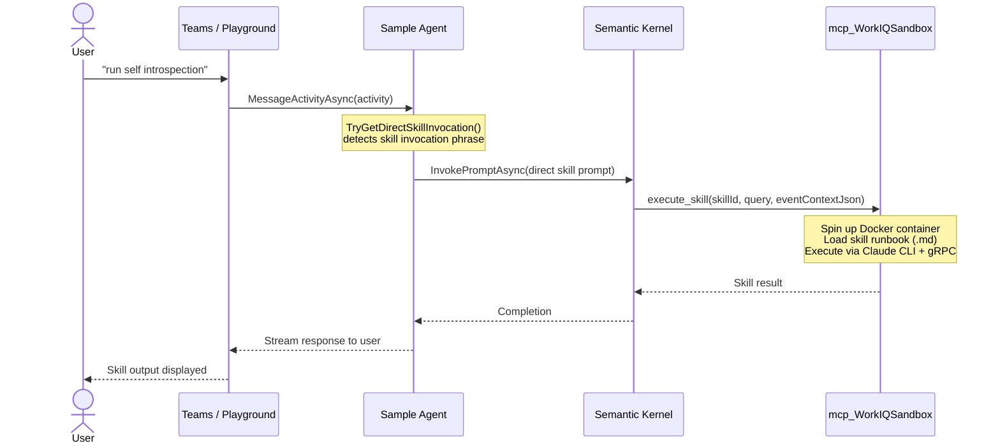
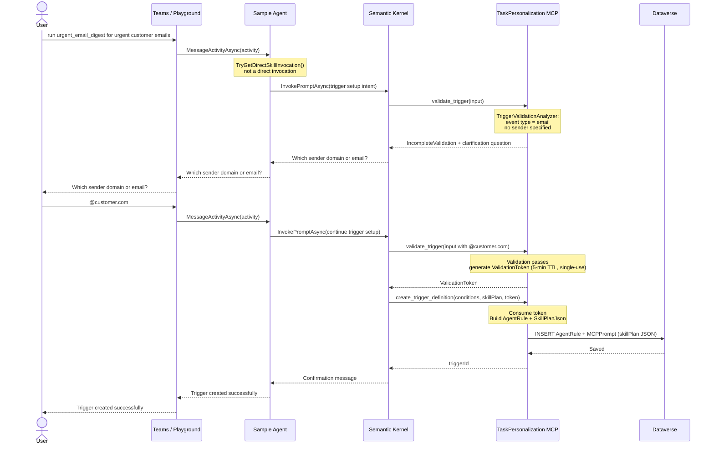
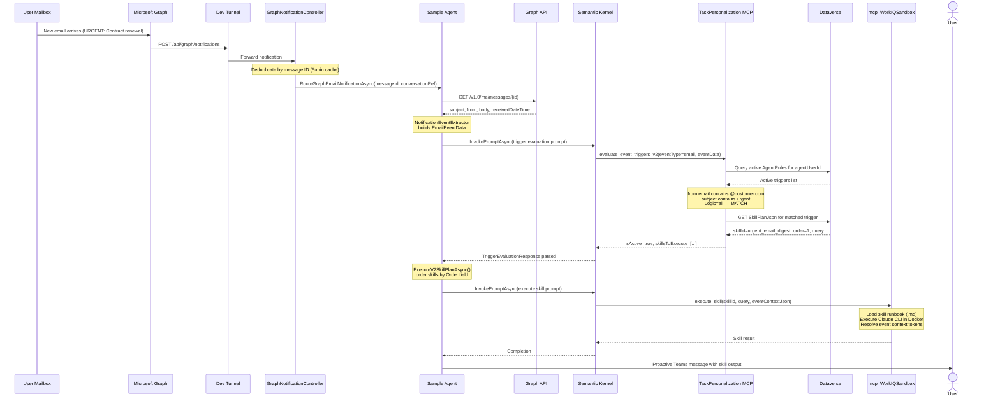

# Task Personalization POC — Unified Architecture

## Overview

Task Personalization enables Digital Workers (AI agents) to automatically respond to events — emails, Teams messages, SharePoint document comments — based on user-defined business rules called **triggers**. Users define these rules conversationally ("when I get an urgent email from a customer, summarize and forward to my manager"), and the agent executes them automatically whenever a matching event arrives.

This document captures the end-to-end architecture validated in the POC across four integrated systems:

| System | Role |
|--------|------|
| **Sample Agent** (Semantic Kernel) | Orchestrates events, evaluates triggers, executes skills |
| **Task Personalization MCP Server** | Stores and evaluates trigger definitions |
| **Graph Notification Integration** | Delivers real-time email/calendar change events to the agent |
| **WorkIQ Sandbox** | Executes sandboxed skills deterministically |

---

## System Architecture

```
┌─────────────────────────────────────────────────────────────────────────────┐
│                              USER INTERACTION                               │
│                                                                             │
│   Teams / Bot Framework Emulator / Agents Playground                       │
│            │                                                                │
│            │  Chat messages (define triggers, direct skill invocation)      │
│            ▼                                                                │
│   ┌─────────────────────────────────────────────────────────────────────┐  │
│   │                    SAMPLE AGENT (ASP.NET Core)                      │  │
│   │                                                                     │  │
│   │  /api/messages ──► MyAgent.cs ──► Semantic Kernel + Azure OpenAI   │  │
│   │  /api/graph/notifications ──► GraphNotificationController           │  │
│   │                                                                     │  │
│   │  Services:                                                          │  │
│   │  • TriggerEvaluationService   (MCP tool invocation)                 │  │
│   │  • NotificationEventExtractor (email / doc / message parsing)       │  │
│   │  • GraphSubscriptionService   (subscription lifecycle)              │  │
│   │  • SubscriptionRenewalService (background renewal)                  │  │
│   │  • DefaultInstructionSanitizer (prompt injection defense)           │  │
│   └──────────────┬───────────────────────────────┬──────────────────────┘  │
│                  │ MCP tools                     │ MCP tools               │
│                  ▼                               ▼                          │
│   ┌──────────────────────────┐   ┌──────────────────────────────────────┐  │
│   │  mcp_TaskPersonalization  │   │          mcp_WorkIQSandbox           │  │
│   │  ServerV2 (MCP Server)   │   │                                      │  │
│   │                          │   │  execute_skill(skillId, query, ctx)  │  │
│   │  • validate_trigger       │   │  ─────────────────────────────────  │  │
│   │  • create_trigger_def     │   │  Docker Container (gRPC)            │  │
│   │  • evaluate_event_triggers│   │  Claude CLI (skill runbook)         │  │
│   │                          │   │  HTTP → gRPC interceptor             │  │
│   │  ──────────────────────  │   └──────────────────────────────────────┘  │
│   │  Dataverse                │                                             │
│   │  • AgentRule entity       │                                             │
│   │  • MCPPrompt entity       │                                             │
│   └──────────────────────────┘                                             │
│                                                                             │
│   ┌──────────────────────────────────────────────────────────────────────┐ │
│   │                    MICROSOFT GRAPH                                   │ │
│   │                                                                      │ │
│   │  Mailbox change notifications ──► Dev Tunnel ──► /api/graph/notify  │ │
│   │  Graph API (messages, subscriptions)                                 │ │
│   └──────────────────────────────────────────────────────────────────────┘ │
└─────────────────────────────────────────────────────────────────────────────┘
```

---

## Components

### A. Sample Agent (Semantic Kernel)

The Semantic Kernel sample agent is the runtime orchestrator. It handles both conversational messages (trigger setup) and event-driven notifications (trigger execution).

#### Trigger Evaluation Pipeline

When a notification arrives, the agent runs a structured evaluation pipeline:

```
Notification arrives (email / Teams message / Word comment)
        │
        ▼
NotificationEventExtractor.ExtractEventData()
  → EmailEventData   { subject, from.email, from.name, body, receivedDateTime }
  → MessageEventData { text, fromEmail, fromName, channelType, createdDateTime }
  → DocumentEventData{ documentName, commentContent, commentAuthorEmail }
        │
        ▼
(email only) GraphSubscriptionService.FetchEmailMetadataAsync()
  → Enriches EmailEventData with full subject/from/body from Graph API
        │
        ▼
TriggerEvaluationService.BuildTriggerEvaluationPrompt()
  → Agent calls MCP tool: evaluate_event_triggers_v2 with event JSON
        │
        ▼
TriggerEvaluationService.ParseTriggerEvaluationResponse()
  → TriggerEvaluationResponse { IsActive, MatchedTriggerCount,
                                PromptInstructions[], SkillsToExecute[] }
        │
        ├── V2 path (SkillsToExecute): ExecuteV2SkillPlanAsync()
        │     → calls mcp_WorkIQSandbox.execute_skill per skill
        │
        └── V1 path (PromptInstructions): ChatHistoryExtensions.ApplyTriggerInstructions()
              → Sanitize → Deduplicate → Add to SK ChatHistory as system message
              → Agent generates personalized response
```

#### Graph Notification Subscription Lifecycle

```
Agent installs (OnHireMessageAsync)
  → GraphSubscriptionService.CreateSubscriptionAsync(conversationRef)
  → POST /v1.0/subscriptions (resource: "me/messages", changeType: "created")
  → Store subscription ID + conversation reference

Background: SubscriptionRenewalService (hourly)
  → Find subscriptions expiring in < 24 hours
  → PATCH /v1.0/subscriptions/{id} (extend by 71 hours)

Agent uninstalls
  → Delete all subscriptions for that conversation

Graph sends change notification
  → POST /api/graph/notifications (via Dev Tunnel)
  → GraphNotificationController validates token, deduplicates by message ID
  → Routes to MyAgent.RouteGraphEmailNotificationAsync()
```

#### Instruction Application and Safety

`ChatHistoryExtensions.ApplyTriggerInstructions()` adds matched trigger instructions to the Semantic Kernel chat history as a system-level message:

- **Sanitization**: `DefaultInstructionSanitizer` strips prompt injection patterns (`SYSTEM:`, `IGNORE PREVIOUS`, XML/HTML tags), enforces max length (2,000 chars), and limits batch size (max 10 instructions)
- **Deduplication within turn**: Checks chat history for `"TASK INSTRUCTIONS:"` marker
- **Deduplication across turns**: Uses `ITurnState["conversation.triggerInstructionsAdded"]` flag to avoid re-injecting in the same conversation

**Formatted output added to ChatHistory:**
```
TASK INSTRUCTIONS:
1. Summarize the email in 3 bullet points
2. Forward to manager@contoso.com
3. Mark thread as high priority

Execute all instructions above. This may include responding to the user AND/OR taking other actions...
```

#### Key Files

| File | Purpose |
|------|---------|
| `Agent/MyAgent.cs` | Core agent: message routing, notification handling, skill execution |
| `Services/TriggerEvaluation/TriggerEvaluationService.cs` | MCP tool invocation and response parsing |
| `Services/TriggerEvaluation/NotificationEventExtractor.cs` | Extract structured event data from notifications |
| `Services/TriggerEvaluation/IInstructionSanitizer.cs` | Prompt injection defense interface |
| `Services/MailSubscription/GraphSubscriptionService.cs` | Graph subscription CRUD and email enrichment |
| `Services/MailSubscription/SubscriptionRenewalService.cs` | Background renewal task |
| `Extensions/ChatHistoryExtensions.cs` | Apply trigger instructions to SK ChatHistory |
| `Extensions/TriggerEvaluationExtensions.cs` | DI registration (Options pattern) |
| `Extensions/MailSubscriptionExtensions.cs` | DI registration for subscription services |
| `Controllers/GraphNotificationController.cs` | Webhook endpoint for Graph change notifications |

---

### B. Task Personalization MCP Server

The MCP server (`mcp_TaskPersonalizationServerV2`) is the backend for trigger management and runtime event evaluation. It runs as part of MCP-Platform and is accessed via the standard Agent 365 MCP tooling layer.

#### Tools

| Tool | Phase | Description |
|------|-------|-------------|
| `list_event_types` | Design-time | Returns available event types (email, message, document) |
| `get_event_type_schema` | Design-time | Returns filterable properties for a given event type |
| `validate_trigger` | Design-time | Smart validation with auto-detection; returns token on success |
| `create_trigger_definition` | Design-time | Creates trigger in Dataverse (requires validation token) |
| `list_trigger_definitions` | Management | Lists triggers with optional filters |
| `get_trigger_definition` | Management | Retrieves single trigger by ID |
| `update_trigger_definition` | Management | Updates trigger conditions or instructions |
| `delete_trigger_definition` | Management | Permanently removes a trigger |
| `evaluate_event_triggers_v2` | Runtime | Evaluates event against all active triggers; returns matched instructions/skills |

#### Trigger Data Model

Triggers are stored in Dataverse using a hybrid schema — individual columns for queryable metadata, JSON for flexible nested data:

```
AgentRule (Dataverse entity)
├── AgentRuleId       GUID          primary key
├── Name              nvarchar      immutable identifier
├── DisplayName       nvarchar      user-friendly label
├── Description       ntext         optional context
├── EventType         nvarchar(50)  "email" | "message" | "document"
├── Logic             nvarchar(10)  "all" (AND) | "any" (OR)
├── statecode         state         0=Active, 1=Inactive
├── AgentUserId       nvarchar(100) Entra object ID of the agentic user
├── MCPPromptId       GUID (FK)     → MCPPrompt entity (V1 instructions)
└── RuleDefinition    ntext (JSON)
    ├── conditions[]
    │   ├── property   "from.email" | "subject" | "body" | ...
    │   ├── operator   "equals" | "contains" | "startsWith" | ...
    │   └── value      user-specified value
    ├── instructions[]  string[]    (V1: free-text prompt instructions)
    └── skillPlan[]                 (V2: typed SkillInvocation objects)
        ├── skillId    string
        ├── order      int
        ├── parameters JsonElement
        └── query      string       (pre-built by SkillQueryBuilder)
```

#### Two-Phase Validation

Creating a trigger requires validation first, preventing unvalidated data from reaching Dataverse:

```
User says: "notify me when deepak sends a message"
    │
    ▼
validate_trigger(input)
  → TriggerValidationAnalyzer:
    • Auto-detect event type from keywords ("message" → MessageEventData)
    • Extract emails, GUIDs from natural language
    • "deepak" has no email → return IncompleteValidation with clarification question
    • User provides deepak@contoso.com → re-validate → success
    → Returns ValidationToken (5-minute expiry, single-use)
    │
    ▼
create_trigger_definition(triggerData, validationToken)
  → Consume token (prevents bypass)
  → Write AgentRule + MCPPrompt to Dataverse
```

---

### C. Graph Notification Integration

The Graph integration enables the agent to proactively respond to mailbox events without user-initiated conversation.

#### Development Setup

```
Local agent (port 3978)
    ↑ HTTPS forwarding
Dev Tunnel (devtunnel.microsoft.com)
    ↑ POST /api/graph/notifications
Microsoft Graph (change notification delivery)
    ↑ Subscription webhook
User's mailbox (new email arrives)
```

The `start-agent.ps1` script automates:
1. Fetch auth tokens (delegated + agentic)
2. Build and start ASP.NET Core agent
3. Create Dev Tunnel and capture public URL
4. POST `/api/graph/subscribe` with tunnel URL to create Graph subscription

#### Notification Processing

```
Graph POSTs to /api/graph/notifications
    │
    ▼
GraphNotificationController
  ① Validation request (GET ?validationToken=X) → echo back token
  ② Change notification (POST with body)
     • Deduplicate by message ID (5-min thread-safe cache)
     • Extract message ID from notification resource
     │
     ▼
MyAgent.RouteGraphEmailNotificationAsync(messageId, conversationRef)
  → GraphSubscriptionService.FetchEmailMetadataAsync(messageId)
    → GET /v1.0/me/messages/{id}?$select=subject,from,body,receivedDateTime
  → Build EmailEventData with enriched metadata
  → Run trigger evaluation pipeline (see above)
  → Send proactive message to stored conversation reference
```

---

### D. WorkIQ Sandbox

The WorkIQ Sandbox provides sandboxed, deterministic skill execution for V2 triggers. When `evaluate_event_triggers_v2` returns `skillsToExecute`, the agent calls `mcp_WorkIQSandbox.execute_skill` for each skill.

#### Architecture

```
Sample Agent
  → mcp_WorkIQSandbox.execute_skill(skillId, query, eventContextJson)
        │
        ▼
  WorkIQ WebApi (REST)
        │ gRPC
        ▼
  Docker Container
    Claude CLI subprocess
    HTTP-to-gRPC interceptor (proxies bash tool calls back to WebApi)
    Skill runbook file (.md) mounted at runtime
        │
        ▼
  Result returned to agent
```

#### V2 Skill Execution Pattern

```csharp
// MyAgent.cs — ExecuteV2SkillPlanAsync()
var orderedSkills = response.SkillsToExecute.OrderBy(s => s.Order);
foreach (var skill in orderedSkills)
{
    await kernel.InvokePromptAsync(
        $"Use the mcp_WorkIQSandbox.execute_skill tool. " +
        $"Skill: {skill.SkillId}. Query: {skill.Query}. Context: {eventContextJson}"
    );
}
```

Each skill is a markdown runbook file describing the task steps. The sandbox container executes these deterministically using the pre-built query from `SkillQueryBuilder` in the MCP server response.

---

## End-to-End Flows

### Flow 1: Execute a Skill Directly from the Sample Agent

The user explicitly asks the agent to run a skill (e.g., "run self introspection"). `TryGetDirectSkillInvocation()` detects the intent and bypasses trigger evaluation entirely.



---

### Flow 2: Set Up a Skill Execution Based on a Trigger

The user defines a business rule conversationally. The agent validates the intent and stores a typed V2 skill plan in Dataverse via two-phase validation.



---

### Flow 3: Execute a Skill When a Trigger Fires

An email arrives in the user's mailbox. Graph delivers a change notification, the agent enriches the event, evaluates it against stored triggers, and executes the matched skill in WorkIQ Sandbox — all proactively, with no user interaction.



---

## Key Design Decisions

### 1. MCP-Based Trigger Evaluation

Rather than adding a direct HTTP client for trigger evaluation, the agent calls `evaluate_event_triggers_v2` as an MCP tool. This reuses the existing Agent 365 MCP tooling infrastructure (auth, tracing, retries) without any additional service client code in the agent.

### 2. Two-Phase Validation with Tokens

`validate_trigger` must be called before `create_trigger_definition`. On success, `validate_trigger` returns a single-use token with a 5-minute TTL. `create_trigger_definition` consumes the token. This prevents:
- Bypassing validation by calling create directly
- Replay attacks from reusing validation results
- Storing unvalidated data in Dataverse

### 3. V1 / V2 Dual Format Support

The system supports both response formats for backward compatibility:
- **V1** (`promptInstructions[]`): Free-text instructions injected into SK ChatHistory. Existing triggers continue to work.
- **V2** (`skillsToExecute[]`): Typed skill invocation objects with pre-built queries. Deterministic execution without LLM in the execution path.

Routing logic checks `IsActive && SkillsToExecute?.Any()` first; falls back to V1 instructions.

### 4. Prompt Injection Defense

Trigger instructions are user-controlled content stored in Dataverse and injected into the agent's system context at runtime. `DefaultInstructionSanitizer` filters before injection:
- **Pattern filtering**: Strips `SYSTEM:`, `IGNORE PREVIOUS`, `FORGET EVERYTHING`, ` ```system `, `</system>`, etc.
- **Tag removal**: Regex strips `<...>` tags
- **Length limits**: Max 2,000 chars per instruction, max 10 instructions per batch

### 5. Instruction Deduplication

Trigger instructions must not be re-injected on every message turn in a multi-turn conversation:
- **Within-turn**: Checks existing ChatHistory for `"TASK INSTRUCTIONS:"` marker
- **Across-turns**: `ITurnState["conversation.triggerInstructionsAdded"]` flag persists across the conversation's lifetime

### 6. Hybrid Dataverse Schema

The `AgentRule` entity uses individual columns for queryable fields (`EventType`, `Logic`, `statecode`, `AgentUserId`) and a JSON `RuleDefinition` field for variable-length nested data (conditions array, instructions array, V2 skill plan). This avoids schema migrations when adding new condition types or skill attributes.

### 7. Email Enrichment Pipeline

Graph change notifications carry only a message ID, not the full email content. The agent fetches full metadata (`subject`, `from`, `body preview`) from the Graph API before trigger evaluation. This ensures conditions like `subject contains "urgent"` have accurate data to match against.

---

## POC Accomplishments

| Area | Status | Notes |
|------|--------|-------|
| Trigger CRUD via MCP tools | ✅ Complete | Full lifecycle: create, read, update, delete, list |
| Smart trigger validation | ✅ Complete | Event type auto-detection, email extraction, multi-turn clarification |
| Two-phase validation tokens | ✅ Complete | 5-min TTL, single-use, prevents bypass |
| Graph mail subscription | ✅ Complete | Create on install, auto-renew, cleanup on uninstall |
| Email enrichment from Graph | ✅ Complete | Fetches full email before evaluation |
| V1 instruction-based execution | ✅ Complete | Instructions injected into SK ChatHistory |
| V2 skill-based execution | ✅ Complete | Typed SkillToExecute → WorkIQ Sandbox |
| WorkIQ Sandbox integration | ✅ Complete | execute_skill called per V2 skill plan |
| Prompt injection defense | ✅ Complete | IInstructionSanitizer with configurable patterns |
| Multi-turn deduplication | ✅ Complete | ITurnState flag + ChatHistory check |
| Document notification handling | ✅ Complete | Word comment events via NotificationEventExtractor |
| Teams message triggers | ✅ Complete | MessageEventData with channelType/sender |
| Developer tooling | ✅ Complete | start-agent.ps1, setup docs, .env.template |

---

## Known Limitations and Next Steps

### Limitations (POC Scope)

| Issue | Location | Impact | Recommended Fix |
|-------|----------|--------|----------------|
| In-memory subscription storage | `GraphSubscriptionService` | Subscriptions lost on restart | Replace with `IStorage`-backed persistent store |
| Static state race condition | `MyAgent.cs` (`IsApplicationInstalled`, `TermsAndConditionsAccepted`) | Multi-tenant conflicts | Move flags to `ITurnState` or `IStorage` |
| Single skill execution | `ExecuteV2SkillPlanAsync()` | Only first ordered skill runs | Implement ordered multi-skill sequence |
| Access token not refreshed | `GraphSubscriptionService` | Long-running renewal may fail | Use refresh token or managed identity |
| DLP checks stubbed | WorkIQ Sandbox skill runner | No real data loss prevention | Integrate real DLP API in V2 full rollout |

### Next Steps

1. **Productionize subscription storage** — Move conversation references and subscription IDs to Agent 365 `IStorage` for restart resilience
2. **Multi-skill execution** — Support ordered execution of multiple skills from a single trigger match (V2 full rollout)
3. **Org-level skill library** — Allow organizations to register custom skill `.md` files alongside platform defaults
4. **Real DLP integration** — Replace stub guards in WorkIQ Sandbox with actual Data Loss Prevention API calls
5. **Trigger management UI** — Surface trigger CRUD in a task pane or Teams tab for non-conversational management

---

## Configuration Reference

### appsettings.json (Sample Agent)

```json
{
  "GraphSubscription": {
    "NotificationUrl": "https://<devtunnel-id>-3978.devtunnels.ms/api/graph/notifications",
    "ChangeType": "created",
    "Resource": "me/messages",
    "ExpirationHours": 71
  },
  "TriggerEvaluation": {
    "McpPlatformUrl": "https://<mcp-platform-url>",
    "MaxInstructionLength": 2000,
    "MaxInstructionCount": 10
  },
  "AIServices": {
    "AzureOpenAI": {
      "Endpoint": "https://<your-openai>.openai.azure.com",
      "DeploymentName": "gpt-4o",
      "ApiKey": "<<PLACEHOLDER>>"
    }
  }
}
```

### MCP Server Registration (ToolingManifest)

```json
{
  "mcpServers": [
    { "mcpServerName": "mcp_TaskPersonalizationServerV2" },
    { "mcpServerName": "mcp_MailTools" },
    { "mcpServerName": "mcp_WorkIQSandbox" }
  ]
}
```
